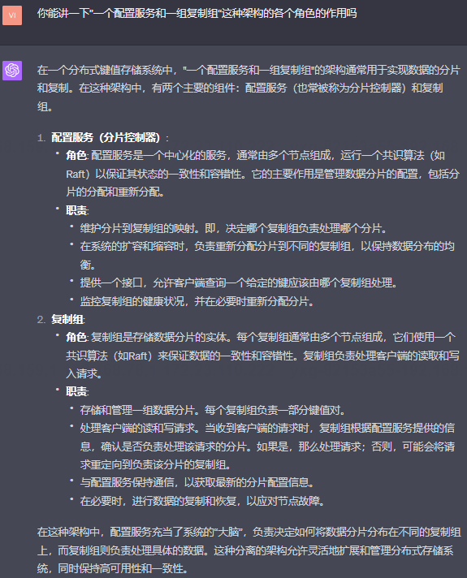
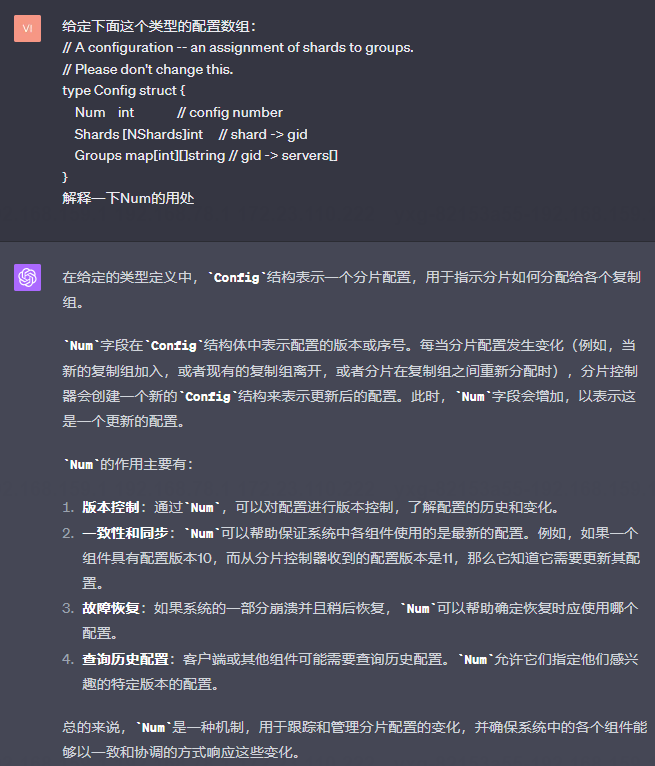
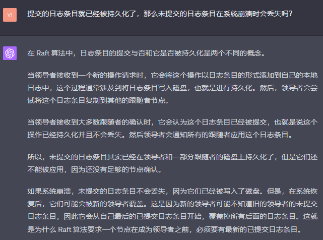
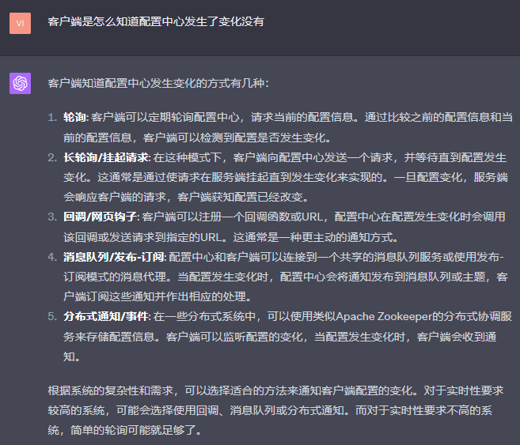
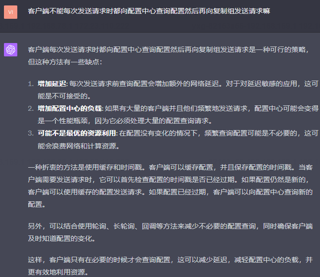

<h1 align="center">MIT6.5840 (6.824) - Replication of Distributed System Course Labs</h1>

Replication of the Spring 2023 MIT6.5840 (previously known as 6.824) Distributed Systems Labs

This project involves the lab exercises from MIT's 6.824 Distributed Systems course, primarily developed in the Go programming language.

# 1 Project Structure

## 1.1 Branches
The project is divided into 9 branches, each precisely corresponding to a part of each lab in the course, named in the format Lab2A, Lab2B, etc.
Each branch contains detailed documentation, **including case studies of bug fixes, explanations of concepts, detailed analysis of test functions, and answers to frequently asked questions (which may come up in interviews)**.
I believe that this step-by-step branching method will be helpful, as I was confused when referring to other people's code that included content from later labs, which was difficult to understand and riddled with bugs.
Repository structure:

## 1.2 Usage Instructions:
To ensure the program runs without bugs, test each part at least 1000+ times; I achieved 0 bugs in 1000 tests.
Then use the dstest script in each file for testing, which contains the usage rules.

## 1.3 Distribution of md Documents
Here are partial screenshots of md documents from various branches:

Screenshot of Lab2A branch

Screenshot of Lab2B branch

...

Screenshot of Lab4B branch

## 1.4 Related Resources
1. MIT 6.824 Course Videos: [MIT6.824 Distributed Systems](https://www.bilibili.com/video/BV1qk4y197bB/?spm_id_from=333.337.search-card.all.click)
2. Chinese Course Notes Link: [gitBook-mit6.824 Distributed Systems Public Course Notes](https://mit-public-courses-cn-translatio.gitbook.io/mit6-824/)
3. Course Schedule: https://pdos.csail.mit.edu/6.824/
4. Related Papers:
   (1) [CSDN Translation of Raft Paper](https://blog.csdn.net/lengxiao1993/article/details/108524808)
   (2) [Spanner: Google’s Globally-Distributed Database](https://pdos.csail.mit.edu/6.824/papers/spanner.pdf)
5. Raft Paper Notes (Notes): https://thesquareplanet.com/blog/students-guide-to-raft/

This project is a personal interpretation and implementation of the MIT 6.824 course. If you have any questions or suggestions, feel free to raise them.

Finally, I wish every participant gains something in their journey of learning distributed systems!

## 1.5 Time Spent
Background: Several years of Java development experience and some C++ usage, never used Golang before
Total Time Spent: 55 days

Lab2A: 10 days

Lab2B: 7 days

Lab2C: 1 day

Lab2D: 10 days

Lab3A: 5 days

Lab2B: 7 days

Lab2C: 5 days

Lab2D: 10 days
# 2 Disclaimer
I intended to use this project for campus recruitment, so I put a lot of effort into it. Thanks to the power of GPT-4, I was able to understand many concepts that were initially unclear to me, through the comprehensive analyses provided by GPT-4.
You can refer to my blog summarizing 100 interview questions about Raft: [100 Raft Interview Questions to Tear Apart](https://blog.csdn.net/yxg520s/article/details/130977890?spm=1001.2014.3001.5502)

The above content was copied from a markdown document. Please translate it into English while keeping the original format intact.
