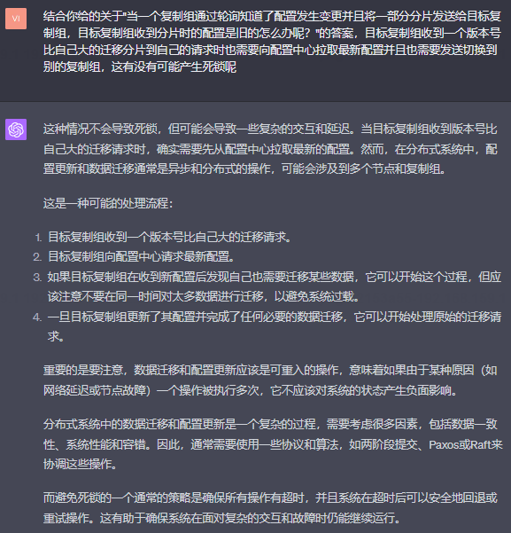
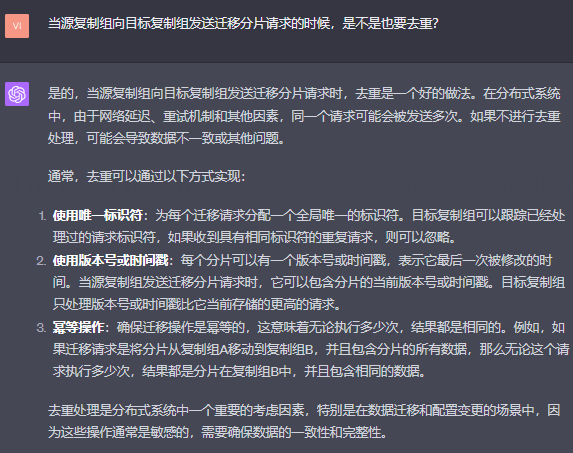
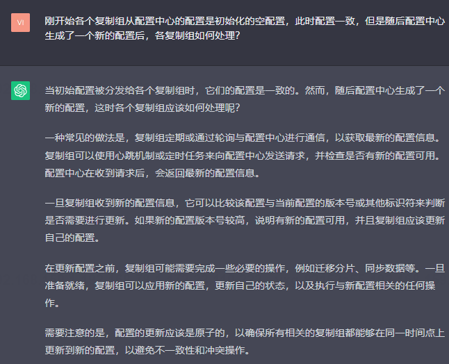

<h1 align="center">MIT6.5840（6.824）-Distributed-System Lab4B</h1>

The Lab4A's realization of MIT6.5840(also early called 6.824) Distributed System in Spring 2023

至于4A的实现，非常推荐大家看一下这篇csdn博客，
[MIT6.824-lab4A-2022（万字推导思路及代码构建）](https://blog.csdn.net/weixin_45938441/article/details/125386091?spm=1001.2014.3001.5502)

我的代码和这篇博客不相同，但是这个人讲解的非常好

这里我把分片控制器称之为配置中心，后面都是这样的。

# 1 数据库分片的基础知识
## 1.1 此lab中数据库的分片所采用的架构？

> 作业中讲到的：This lab's general architecture (a configuration service and a set of replica groups) 
> follows the same general pattern as Flat Datacenter Storage, BigTable, Spanner, FAWN, Ap
> ache HBase, Rosebud, Spinnaker, and many others. These systems differ in many details 
> from this lab, though, and are also typically more sophisticated and capable. For example, 
> the lab doesn't evolve the sets of peers in each Raft group; its data and query models are 
> very simple; and handoff of shards is slow and doesn't allow concurrent client access.

核心：a configuration service and a set of replica groups

Lab4A需要实现的就是其中的配置服务部分，也可以称为shard controller，其实现和Lab3A大同小异，**唯一比较耗时的
是负载均衡部分**。


## 1.2 讲一下”一个配置服务和一组复制组“这种架构的各个角色的作用


## 1.3 在“一个配置服务和一组复制组”架构下，读写请求如何打给复制组的？


在Lab3的introduction中也规定了我们必须得实现控制器的几个接口，
其中有一个Query接口，用于客户端查询相关键的配置信息，包括这个键值对存储在
哪一个复制组中，为什么需要定义这个接口呢，其目的就是给客户端提供具体键值对
所在复制组的信息以供其将读写请求打到具体的复制组

## 1.4 在“一个配置服务和一组复制组”架构下，客户端的读写请求需要两次访问


## 1.5 这种架构的其他应用


# 2 Lab4B任务分解

## 2.1 这里的一个复制组是怎么表示的？

## 2.2 server.go的ShardKV表示一个复制组的一个节点，怎么表示一个复制组

## 2.3 StartServer的方法参数说明

### 2.3.1 servers []*labrpc.ClientEnd, persister *raft.Persister, 

> 表示当前shardKV server所在的复制组的其他节点，这个一般用于传递给raft节点使用，因为底层的raft的leader节点需要
> 将日志和快照同步给从节点，就必须知道所有对等节点的信息

> persister同上
### 2.3.2 StartServer的方法参数gid有什么用？
> 方法注释上说用于和配置中心交互使用，但是具体会涉及到哪些操作呢？难道是会调用join，leave等方法将自己主动从配置中心
> 移除或者加入？


## 2.3.3 ctrlers []*labrpc.ClientEnd
这个参数表示可以向配置中心的所有节点发送消息的端口，通过这个可以调用配置中心的Query方法，从而获取最新的配置，
并且和本地获取到的配置进行比较，如果探测到发生了配置变更，则需要暂停向外提供key/value存储服务，先按照配置
将分片迁移完毕，然后再恢复服务，这一过程就是静态迁移，至于如何实现动态迁移，那是在challenge部分考虑的事情。

## 2.3.4 make_end func(string) *labrpc.ClientEnd
函数前的注释是这样说的：
> make_end(servername) turns a server name from a
> Config.Groups[gid][i] into a labrpc.ClientEnd on which you can
> send RPCs. You'll need this to send RPCs to other groups.

意思就是会将从配置中心取得的服务器名（Config.Groups[gid][i]）转换成与目标复制组该服务器名对应的labrpc.ClientEnd，
这个ClientEnd相当于目标节点对应的端点，客户端只有取得这个端点才有资格访问目标节点的API

ctrlers []*labrpc.ClientEnd参数也是给特定机器发送rpc的，为什么与make_end的不同？


## 2.4 作为整个分布式KV系统的客户端，可以同时访问配置中心和复制组嘛？

> 答：是的，因为用户通过hash或者取模算法后知道自己存取的key所属的分片id后，需要往配置中心请求最新的配置，这个配置里面
> 包含了该分片id所属的复制组地址，然后客户端会再根据这个地址向复制组发送crud存取请求。

## 2.5 客户端是怎么知道配置中心发生了变化没有


我的方案：其实从common.go文件中的ErrWrongGroup就可以看出老师也推荐这种方案


## 2.6 当某一个复制组中的大多数节点下线时，如何处理？
> 这个复制组不能对外提供KV服务，但是不影响其他复制组的正常工作，也就是说存在一部分打到这个异常的复制组的请求
> 会被拒绝掉

## 2.7 如果各个复制组采用轮询的方式检查最新的配置有没有发生变化，只有leader才能轮询嘛


## 2.8 shardKV服务端怎么知道控制中心的配置是否发生变更，如果它每次获取的配置都是一样的呢


## 2.9 分片迁移相关的策略
1 当复制组决定迁移分片的时候，是不是得遍历数据库中的所有值，并且计算它们的key所属的分片id，再根据配置查询是否发生变动，如果是就需要迁移？


2 你说的分片索引策略，是指使用一个map，key为分片id，value为一个数据库中属于该分片的key值列表嘛


3 你给的map中，value是不是也可以是一个set集合，这样的话，增删改查的复杂度为O(1)


4 除了携带key，value以及操作类型外，客户端访问复制组时是否需要携带key所属的分片id？
> 可以携带，因为不影响客户端取得正确数据
> 
> 情况一：如果客户端使用的是最新的配置，其中某一个key的shard为1，
> 所属的复制组为B，但是所有的服务端使用的是旧配置， 这个key的shard为1（因为客户端服务端
> 都使用相同的key->shardId的映射规则），但是所属于的复制组为A，那么复制组B收到请求后
> 会拒绝服务，并且返回客户端一个ErrWrongGroup的错误，但是客户端会不断轮询这个复制组,
> 直到复制组A的轮询器从配置中心探测到了最新的配置并且迁移数据到B后，复制组B才会返回客户端
> 所需要的数据。
> 
> 情况二：如果客户端使用的是旧的配置，某一个key的shard为1，所属的复制组为B，服务端使用的新的配置。
> 所属的复制组为A，客户端会将请求打给复制组B但是会被响应一个ErrWrongGroup的错误，随后客户端
> 会访问配置中心拿到正确的配置后访问正确的复制组A，然后顺利取得数据

## 2.10 判断新旧配置时，为什么不推荐比较版本号，哈希值的方法


## 2.11 当一个复制组通过轮询知道了配置发生变更并且将一部分分片发送给目标复制组，目标复制组收到分片时的配置是旧的怎么办呢？


## 2.12 你给的代码中如何实现增量迁移


## 2.13 当一个复制组检测配置发生变更时，只想要将其不受自己管理的分片进行迁移，其他的不变，有什么好的实现方案吗?


## 2.14 当一个复制组检测到配置发生变更时，需要迁移完成后才能更新配置嘛


## 2.15 结合你给的关于"当一个复制组通过轮询知道了配置发生变更并且将一部分分片发送给目标复制组，目标复制组收到分片时的配置是旧的怎么办呢？"的答案，目标复制组收到一个版本号比自己大的迁移分片到自己的请求时也需要向配置中心拉取最新配置并且也需要发送切换到别的复制组，这有没有可能产生死锁呢


## 2.16 当源复制组向目标复制组发送迁移分片请求的时候，是不是也要去重？


## 2.17 leader节点发送分片数据给其他节点的过程应该不需要下放到raft节点对吧


## 2.18 在leader下放分片成功的结果到上层状态机执行切换配置成功的这段时间，客户端的请求打过来了呢？

> 粗粒度做法：这个阶段应该拒绝所有响应客户端的请求，保持重新分片到更新数据到更换配置这一整个过程的原子性

> 细粒度：使用一个map记录所有正在迁移中的分片，对于收到客户端的GET/PUT请求时查看该key对应的分片是否
> 存在这个map当中，如果不在就可以响应

## 2.19 如何保证保持重新分片（包括接收分片和发送分片全部成功）到更新数据到更换配置这一整个过程的原子性？
> 
> 

接收方回复来自发送方的过期的rpc，响应的状态字段怎么设置，发送方如何处理针对过期rpc的响应?
> 接收方响应的状态字段设置为ErrStaleGroup，发送方收到针对过期的rpc的回复时，可以视为接收方已经正确接收并且正确应用了发送的分片，
> 所以可以直接return掉。

这种现象出现的原因？
> 可以理解为网络拥堵，发送方重复发送了多个包含分片的rpc，然后接收方回复的多个rpc中可能状态为OK的正确响应也因为
网络拥堵迟到了，但是状态字段为ErrStaleGroup的可能早一些到达发送方，所以，发送方的处理如下：
```go
func (kv *ShardKV) sendShards2TargetGroup(op Op, data map[string]string, targetReplicaGroupNames []string) {

	kv.SeqId++
	args := MoveShardsArgs{Gid: kv.gid, SeqId: kv.SeqId, Data: data, Cfg: op.ConfigOp.Cfg, TranferringShards: op.ConfigOp.TranferringShards}

	for {
		// try each known server.
		for _, serverName := range targetReplicaGroupNames {
			var reply MoveShardsReply
			ok := kv.make_end(serverName).Call("ShardKV.receiveSharding", &args, &reply)
			// 直到Ok才返回
			if ok && reply.Err == OK {
				//fmt.Printf("向%d发送请求,结果返回成功", srv)
				return
			}
			if ok && reply.Err == ErrStaleConfig {
				//fmt.Printf("向%d发送请求,结果返回成功", srv)
				DPrintf(111, "接收方已经正确更新分片：ErrStaleConfig")
				return
			}

		}
		time.Sleep(100 * time.Millisecond)
	}
}
```

## 2.20 如果等所有分片迁移完成再下放raft是不是有这个问题：针对推的设置：分片迁移到一半突然宕机，那这个日志不就缺失了嘛

> 问题说明：意思是分片会迁移到复制组B，C，在迁移完B的后就宕机了，假设我们要求必须全部迁移完成才会下放
> "删除迁移完成的键值对"命令给raft，那么这里的键值对会删除不成功，同时有可能会产生应用配置的动作也应用不成功
> 重启后依然使用的是旧配置 但是一部分键已经迁移成功, 另一部分失败，这个时候如何处理呢？

答： 重启后状态机通过轮询协程会进一步检测到新配置，然后还会继续刚才的发送过程，因为没有记录已经成功发送给B，
所以B仍然会被发送分片但是会被拒收并且被B返回一个ErrOldConfig的状态，
但是A认为是成功接受了，所以就开始给C发送分片直到成功发送，这个时候就相当于能继续完成宕机前的配置更新操作了

## 2.21 复制组的加入和配置中心的配置切换过程

### 1 如果一个新的复制组加入系统，是先放置复制组还是还是先更新配置呢？

### 2 如果一个复制组要离开系统，是先更新配置还是先下线复制组？

### 3 刚开始各个复制组从配置中心的配置是初始化的空配置，此时配置一致，但是随后配置中心生成了一个新的配置后，各复制组如何处理？


### 4 复制组中的数据为空的时候，此时又探测到新配置，如何确定是否发送分片呢？

### 5 复制组生成一个新配置，这个配置中所有的分片都只分给一个复制组A，但是集群中有A和B两个复制组，难道这时候B复制组也要将所有的数据迁移到A嘛？
> 是的

### 6 复制组的初始配置中，所有的分片都分配给了gid为0的虚拟复制组，但是复制组A，B拉取到新配置的时候发现分片有一部分是分给自己的（难道要给自己发送rpc嘛），有一部分分给另一个复制组，这种情况如何处理？
> 这个时候可以针对corner case做特殊处理，比如初始时如果分片都为0，


### 7 有没有可能在配置中心更新初始配置（初始配置指分片的gid指向0）之前就有客户端的读写请求打到某一个复制组A呢？
> 不可能，因为客户端也需要先查询配置中心拿到具体的复制组gid，发现gid为0时则必然不可能打到编号非0的复制组

# 3 Lab4A任务分解

## 3.1 Lab4a的具体任务？

> 答：从上面来看，我们的任务就是实现一个基于raft日志复制的配置服务中心，
> 跟Lab3非常的类似, 只不过4不需要实现快照功能，我们只需要将Lab3中的
> Put/Get/Append命令换成Query/Leave/Join/Move等命令即可。

## 3.2 一个gid代表一个复制组，这个复制组里的机器宕机后是不是可以加入别的复制组？


## 3.3 为什么这里不用对状态机进行持久化?
> 如果仅仅对下层的raft日志进行持久化，则无需持久化上层状态机的数据，因为可以通过重放日志恢复数据状态，
> 只有当需要对日志进行快照操作时才需要也对数据状态快照，并且持久化日志和状态，以便删除快照之前的日志，然后
> 再利用之后的日志和快照的数据状态进行快速重放。

## 3.4 结构体Config的num字段解析


## 3.5 所以一个集群中只有一个是配置是有效的对吗


## 3.6 当撤销掉/新增一个复制组后，如何对分片进行负载均衡？

### 3.6.1 当新增一个复制组时:

需要注意两点，

1 应该new 一个配置，做一个深拷贝，而不是直接将当前的最新配置的地址加到配置分片的末尾或浅拷贝

2 合并新旧复制组后，需要新建一个切片，将所有复制组的gid放入切片中，然后再排序，后面计算每个复制组需要
的分片数，以及重新分片的时候都需要按照gid切片的顺序处理，这是因为不同协程遍历同一个map的键时是乱序的，
所以很有可能导致分片状态在几个节点中不一致

```go

func (sc *ShardCtrler) RebalanceShardsForJoin(newGroups map[int][]string) {
	// 获取最新的配置
	oldConfig := sc.configs[len(sc.configs)-1]
	newConfig := Config{
		Num:    oldConfig.Num + 1,
		Shards: oldConfig.Shards,
		Groups: make(map[int][]string),
	}
	DPrintf(111, "join之前，检查到旧的复制组为:%v", oldConfig.Groups)

	// 合并旧的和新的复制组
	for gid, servers := range oldConfig.Groups {
		newConfig.Groups[gid] = servers
	}
	for gid, servers := range newGroups {
		newConfig.Groups[gid] = servers
	}

	// 计算目标分片数
	totalShards := len(oldConfig.Shards)
	totalGroups := len(newConfig.Groups)
	shardsPerGroup := totalShards / totalGroups
	extraShards := totalShards % totalGroups

	// 获取复制组ID并按顺序排序，因为
	// shardCounts := make(map[int]int)是一个map，在后面的遍历时for newGid, count := range shardCounts，这是乱序的，因为这个方法会在不同的状态机中执行，所以会导致分片结果不一致
	groupIDs := make([]int, 0, len(newConfig.Groups))
	for gid := range newConfig.Groups {
		groupIDs = append(groupIDs, gid)
	}
	sort.Ints(groupIDs)

	// 计算每个复制组需要的分片数量
	shardCounts := make(map[int]int)
	// 按顺序为每个GID分配分片
	for _, gid := range groupIDs {
		shardCounts[gid] = shardsPerGroup
		if extraShards > 0 {
			shardCounts[gid]++
			extraShards--
		}
	}

	// 重新分配分片
	// 大概思想是遍历每一个分片，如果该分片对应的gid所代表的复制组需要的分片为0，
	// 则表示这个分片可以分配给其他复制组，所以遍历所有复制组直到找到一个需要分片数
	// 大于0的组，然后就将这个分片给它
	for shard, gid := range newConfig.Shards {
		if shardCounts[gid] <= 0 {
			// 遍历已排序的复制组ID
			for _, newGid := range groupIDs {
				count := shardCounts[newGid]
				if count > 0 {
					newConfig.Shards[shard] = newGid
					shardCounts[newGid]--
					break
				}
			}
		} else {
			shardCounts[gid]--
		}
	}
	sc.configs = append(sc.configs, newConfig)

	DPrintf(1111, "[节点%d执行Join之后最新配置信息]: len(sc.configs)：%v, sc.configs[len(sc.configs)-1].Num： %v, sc.configs[len(sc.configs)-1].Shards： %v, sc.configs[len(sc.configs)-1].Groups： %v",
		sc.me, len(sc.configs), sc.configs[len(sc.configs)-1].Num, sc.configs[len(sc.configs)-1].Shards, sc.configs[len(sc.configs)-1].Groups)
}
```

### 3.6.2 当撤销一个复制组时的负载均衡怎么做到？

除了2.6.1中提到的两点，撤销一个复制组时还有一个额外需要处理的corner case，比如当增加一个gid为1复制组，
此时所有shards的都分配给了1，然后又撤销这个复制组时，此时shards应该都指向0，

```go
func (sc *ShardCtrler) RebalanceShardsForLeave(removedGIDs []int) {
	// 获取最新的配置
	oldConfig := sc.configs[len(sc.configs)-1]
	newConfig := Config{
		Num:    oldConfig.Num + 1,
		Shards: oldConfig.Shards,
		Groups: make(map[int][]string),
	}

	// 将 removedGIDs 转换为 map 以便快速查找
	removedGIDMap := make(map[int]bool)
	for _, gid := range removedGIDs {
		removedGIDMap[gid] = true
	}
	DPrintf(111, "待移除的复制组为：%v", removedGIDMap)

	// 合并旧的复制组，但不包括要移除的
	for gid, servers := range oldConfig.Groups {
		if !removedGIDMap[gid] {
			newConfig.Groups[gid] = servers
		}
	}
	DPrintf(111, "此时有效的复制组为: %v,长度为%d", newConfig.Groups, len(newConfig.Groups))
	// 移除后如果集群中复制组为0，则需要将所有分片的GID指定为0，意味着没有使用复制组
	// 同时在返回前将新配置加入组中
	if len(newConfig.Groups) == 0 {
		for shard, _ := range newConfig.Shards {
			newConfig.Shards[shard] = 0
		}
		// 将新配置添加到配置列表
		sc.configs = append(sc.configs, newConfig)
		return
	}
	// 计算目标分片数
	totalShards := len(oldConfig.Shards)
	totalGroups := len(newConfig.Groups)
	if totalGroups == 0 {
		// 不能有零个复制组
		return
	}
	shardsPerGroup := totalShards / totalGroups
	extraShards := totalShards % totalGroups

	// 获取复制组ID并按顺序排序
	groupIDs := make([]int, 0, len(newConfig.Groups))
	for gid := range newConfig.Groups {
		groupIDs = append(groupIDs, gid)
	}
	sort.Ints(groupIDs)

	// 计算每个复制组需要的分片数量
	shardCounts := make(map[int]int)
	// 按顺序为每个GID分配分片
	for _, gid := range groupIDs {
		shardCounts[gid] = shardsPerGroup
		if extraShards > 0 {
			shardCounts[gid]++
			extraShards--
		}
	}

	// 重新分配分片
	for shard, gid := range newConfig.Shards {
		if removedGIDMap[gid] || shardCounts[gid] <= 0 {
			// 遍历已排序的复制组ID
			for _, newGid := range groupIDs {
				count := shardCounts[newGid]
				if count > 0 {
					newConfig.Shards[shard] = newGid
					shardCounts[newGid]--
					break
				}
			}
		} else {
			shardCounts[gid]--
		}
	}
	// 将新配置添加到配置列表
	sc.configs = append(sc.configs, newConfig)
	DPrintf(1111, "[节点%d Leave后最新配置信息]: len(sc.configs)：%v, sc.configs[len(sc.configs)-1].Num： %v, sc.configs[len(sc.configs)-1].Shards： %v, sc.configs[len(sc.configs)-1].Groups： %v",
		sc.me, len(sc.configs), sc.configs[len(sc.configs)-1].Num, sc.configs[len(sc.configs)-1].Shards, sc.configs[len(sc.configs)-1].Groups)
}
```
