<h1 align="center">MIT6.5840（6.824）-Distributed-System Lab2B</h1>

The Lab2b's realization of MIT6.5840(also early called 6.824) Distributed System in Spring 2023
# 1 从分析Lab2B测试函数结构到弄懂整个Lab2B的coding框架
> 在debug的时候多分析一下测试程序的测试点是非常重要的，弄懂了测试结构就知道了
> 本lab的代码结构，因为这涉及到代码调用和实现，比如tester是如何让节点下线的，配置
> 是如何清除各个raft实例的，leader状态是如何被tester获取的，、
> 集群中各个节点的提交日志是如何被tester探测到的
## 1.1 Test (2B) - TestBasicAgree2B
说明：该函数主要用于检查在没意外情况下是否每个提交都能在集群达成一致
下面是这个测试方法的主要内容：


可以看到该方法内也调用了cfg.nCommitted(index)和cfg.one这两个方法，它们也是后面测试点
用到的主要方法，下面我们着重分析一下

1 nCommitted
方法截图：

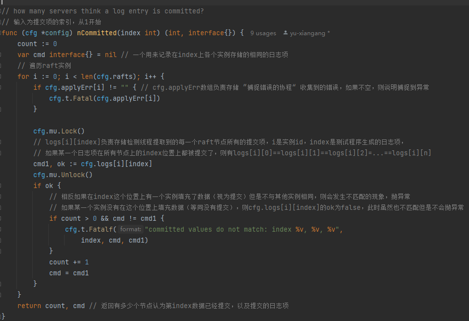

详细注释：
```go
// how many servers think a log entry is committed?
// 输入为提交项的索引，从1开始

func (cfg *config) nCommitted(index int) (int, interface{}) {
    count := 0
    var cmd interface{} = nil // 一个用来记录在index上各个实例存储的相同的日志项
    // 遍历raft实例
    for i := 0; i < len(cfg.rafts); i++ {
        if cfg.applyErr[i] != "" { // cfg.applyErr数组负责存储 ”捕捉错误的协程“ 收集到的错误，如果不空，则说明捕捉到异常
            cfg.t.Fatal(cfg.applyErr[i])
        }
    
        cfg.mu.Lock()
        // logs[i][index]负责存储检测线程提取到的每一个raft节点所有的提交项，i是实例id，index是测试程序生成的日志项，
        // 如果某一个日志项在所有节点上的index位置上都被提交了，则有logs[i][0]==logs[i][1]==logs[i][2]=...==logs[i][n]
        cmd1, ok := cfg.logs[i][index]
        cfg.mu.Unlock()
        if ok {
            // 相反如果在index这个位置上有一个实例填充了数据（视为提交）但是不与其他实例相同，则会发生不匹配的现象，抛异常
            // 如果某一个实例没有在这个位置上填充数据（等同没有提交），则cfg.logs[i][index]的ok为false，此时虽然也不匹配但是不会抛异常
            if count > 0 && cmd != cmd1 {
                cfg.t.Fatalf("committed values do not match: index %v, %v, %v",
                    index, cmd, cmd1)
            }
            count += 1
            cmd = cmd1
        }
    }
    return count, cmd // 返回有多少个节点认为第index数据已经提交，以及提交的日志项
}
```
2 cfg.logs的变量的更新方法

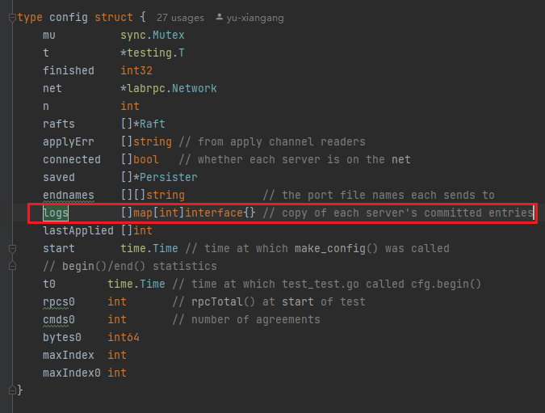

如上图所示，cfg.logs是一个map数组，定义在cfg结构体中，是一个作用主要是存储集群中各个节点提交的所有日志，
所以重点是弄懂怎么更新这个变量的。
我在config.go的文件里找到了这个方法checkLogs，如下图，传入的参数是一个ApplyMsg, 

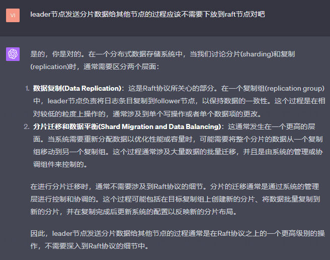

然后我们又发现这个方法被一个叫applier的方法使用，而且该方法的传入参数是一个ApplyMsg类型的管道，如下图

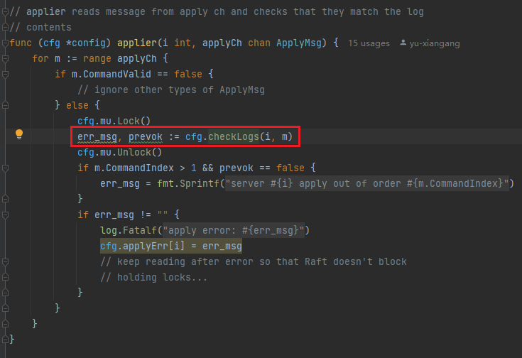

> 因此，为了使得我们各个节点的日志能被tester检测到（相当于注入logs中），我们就必须往
> ApplyMsg类型的管道注入信息，这样就会被config里的applier函数消费。
> 我们再回到raft文件，发现make函数刚好提供了一个参数是ApplyMsg类型的管道，因此我们只需要
> 利用这个管道即可。

3 cfg.one()方法
> 说明：该方法的返回值是一个各个节点存储同一个日志项时放置的位置索引，它用于确定生产日志时的顺序是否和
多数节点放置该日志的顺序一致。如果一致则说明存储位置正确，否则抛异常。

```go
func (cfg *config) one(cmd interface{}, expectedServers int, retry bool) int {
	t0 := time.Now()
	starts := 0
	// 10s内每隔50ms如果cfg节点没有挂掉（cfg.checkFinished==false）就持续检测 直到找到一个成为leader的节点，
	// 然后取到start函数生成的日志项在这个leader中日志数组的位置index，然后再利用这个index去确认有多少从节点也复制并且提交了这个日志项
	for time.Since(t0).Seconds() < 10 && cfg.checkFinished() == false {
		// try all the servers, maybe one is the leader.
		index := -1
		for si := 0; si < cfg.n; si++ {
			starts = (starts + 1) % cfg.n
			var rf *Raft
			cfg.mu.Lock()
			if cfg.connected[starts] {
				rf = cfg.rafts[starts]
			}
			cfg.mu.Unlock()
			if rf != nil {
				//rf的start函数，会返回该日志项在leader节点中的日志数组的索引位置，任期以及是否是leader，如果找到了leader则break
				index1, _, ok := rf.Start(cmd)
				if ok {
					index = index1
					break
				}
			}
		}
		// index不等于-1则表示找到了一个存储了cmd日志项的leader节点
		if index != -1 {
			// somebody claimed to be the leader and to have
			// submitted our command; wait a while for agreement.
			t1 := time.Now()
			// 下面这个循环的意思是每隔20ms就轮询一次已经提交内容为cmd的日志项的节点数量是否大于等于expectedServers
			// 为什么是2s内呢？因为正常情况下2s内一定能确认所有的节点都能够提交成功
			for time.Since(t1).Seconds() < 2 {
				nd, cmd1 := cfg.nCommitted(index)
				// 如果是则比较在这个索引位置上各节点提交的日志是否和给定的日志相同，如果相同直接返回索引
				if nd > 0 && nd >= expectedServers {
					// committed
					if cmd1 == cmd {
						// 返回index是为了确认各个节点提交的索引位置是否和start生成的顺序是否一致
						// and it was the command we submitted.
						return index
					}
				}
				time.Sleep(20 * time.Millisecond)
			}
			// 如果不是则看是否重试，不允许重试就抛异常
			if retry == false {
				cfg.t.Fatalf("one(%v) failed to reach agreement", cmd)
			}
		} else {
			time.Sleep(50 * time.Millisecond)
		}
	}
	if cfg.checkFinished() == false {
		// 如果在
		cfg.t.Fatalf("one(%v) failed to reach agreement", cmd)
	}
	return -1
}
```

## 1.2 Test (2B): RPC byte count
根据RPC的字节数，检查领导者每次发送日志给跟随者，在没意外发生的情况下是否出现重发现象

（个人感觉应该是检查心跳频率，控制好次数（100ms一次）或者加个计时器，当在发送是超时的时候不需要重发）

## 1.3 Test (2B): test progressive failure of followers
当只有跟随者宕机时的测试

## 1.4 Test (2B): test failure of leaders
当只有领导人宕机时的测试

## 1.5 Test (2B): agreement after follower reconnects
当出现一个跟随着宕机，并在后面恢复时，是否会实现他的日志恢复成跟领导者一样
代码如下所示：
```go

func TestFailAgree2B(t *testing.T) {
	nextcmd := getcount()
	servers := 3
	cfg := make_config(t, servers, false, false)
	defer cfg.cleanup()

	cfg.begin("Test (2B): agreement despite follower disconnection")

	cfg.one(101, servers, false)

	// disconnect one follower from the network.
	leader := cfg.checkOneLeader()
	cfg.disconnect((leader + 1) % servers)
	DPrintf(1111, "already let the node %d offline to add new entries...", (leader+1)%servers)

	// the leader and remaining follower should be
	// able to agree despite the disconnected follower.
	cfg.one(102, servers-1, false)
	cfg.one(103, servers-1, false)
	time.Sleep(RaftElectionTimeout)
	cfg.one(104, servers-1, false)
	cfg.one(105, servers-1, false)

	// re-connect
	cfg.connect((leader + 1) % servers)
	DPrintf(1111, "after connected, check whether previous added entries can sync to %d...", (leader+1)%servers)

	// the full set of servers should preserve
	// previous agreements, and be able to agree
	// on new commands.
	cfg.one(106, servers, true)
	time.Sleep(RaftElectionTimeout)
	cfg.one(107, servers, true)
	DPrintf(900, "last cmd=%v\n", nextcmd()-1)
	cfg.end()
}
```
当我写完这一部分后发现这里的测试有问题，

问：这里的cfg.cleanup()方法和cfg.disconnect()方法有什么区别?

> 答：乍一看，这个方法好像和cfg.clean()方法有点儿像，但是它们完全是两种故障，cfg.clean()用于测试方法
> 执行结束后清除所有实例占用OS内存，相当于实例下线，但是cfg.disconnect()方法用于将一个raft节点脱离于这个
> 网络，不可达，但是这个节点并没有下线，只是其他节点包括leader节点发送的心跳，日志添加rpc以及leader选举rpc
> 都不能到达这个被下线的节点，同时这个节点发送的任何rpc都不会被扩散到其他节点。可以通过下面的两个分析详细看看
> 实现原理，尤其网络不可达是怎么实现的~
> 
> 节点断联只是将网络断开，但是节点本身还是存活的，所以它的选举时间不断超时然后进行选举再被重置，期间它的任期肯定
> 会增大，所以处理好重连后的节点是一个问题。

1 我们来看看cfg.cleanup()方法

通过代码可以看到，这个方法就是为了杀死所有的raft实例的，通过调用实例的kill方法，将dead变量置为1，
随后实例就会停止进行选举和添加日志的操作。
```go
func (cfg *config) cleanup() {
	for i := 0; i < len(cfg.rafts); i++ {

		if cfg.rafts[i] != nil {
			cfg.rafts[i].Kill()
		}
	}
	cfg.net.Cleanup()
	cfg.checkTimeout()
}

func (rf *Raft) Kill() {
    atomic.StoreInt32(&rf.dead, 1)
    // Your code here, if desired.
    rf.mu.Lock()
    defer rf.mu.Unlock()
    DPrintf(1000, "%v : is killed", rf.SayMeL())
    rf.applyHelper.Kill()
    rf.SetServerStateL(followerState)
}
```

问：那为什么置换dead为1就可以停止所有实例呢？
可以看到这里的定时任务就是通过判断dead是否等于1来决定是否还要继续轮询的，因为ticker相当于不断
轮询是否要选举leader，发送心跳或者日志的定时任务，但是条件是raft实例存活，如果dead=1则不存活，
此时就会程序结束。

```go
func (rf *Raft) killed() bool {
    z := atomic.LoadInt32(&rf.dead) // 这里的kill仅仅将对应的字段置为1
    return z == 1
}
func (rf *Raft) ticker() {
	// 如果这个raft节点没有掉线,则一直保持活跃不下线状态（可以因为网络原因掉线，也可以tester主动让其掉线以便测试）
	for !rf.killed() {
		rf.mu.Lock()
		switch rf.state {
		case Follower:
			DPrintf(111, "I am %d, a follower with term %d and my dead state is %d", rf.me, rf.currentTerm, rf.dead)
			//fallthrough // 相当于执行#A到#C代码块,
			if rf.pastElectionTimeout() {
				rf.StartElection()
			}
		case Candidate:
			DPrintf(111, "I am %d, a Candidate with term %d and my dead state is %d", rf.me, rf.currentTerm, rf.dead)

			if rf.pastElectionTimeout() { //#A
				rf.StartElection()
			} //#C

		case Leader:
			//if !rf.quorumActive() {
			//	// 如果票数不够需要转变为follower
			//	break
			//}
			// 只有Leader节点才能发送心跳和日志给从节点
			isHeartbeat := false
			// 检测是需要发送单纯的心跳还是发送日志
			// 心跳定时器过期则发送心跳，否则发送日志
			if rf.pastHeartbeatTimeout() {
				isHeartbeat = true
				rf.resetHeartbeatTimer()
				//rf.StartAppendEntries(isHeartbeat)
			}
			rf.StartAppendEntries(isHeartbeat)
		}

		rf.mu.Unlock()
		time.Sleep(tickInterval)
	}
	DPrintf(111, "tim")
}
```
2 cfg.disconnect()方法模拟节点断联

> 该方法主要讲解了本lab如何实现一个实例断联但是仍然存活的情况，假设有A,B,C三节点，现在C要断联，可以看到
这里的方法是将cfg.connected[i]置为false，然后将通向断联节点C的路径以及从断联节点到达剩余网络
（A和B组成）的路径打上false标签，表示路径不可达，这样当网络中的A或者B要向C发送消息时会先检查这个路径
是否可达，不可达则消息会发出但是到达不了C节点。
> 

这里的endnames存储的是一个二维数组，存储的是主机i向主机j发送日志时写入的端口文件名，这里的文件名可以当作
i到j的通信路径

```go
// detach server i from the net.
func (cfg *config) disconnect(i int) {
	// fmt.Printf("disconnect(%d)\n", i)

	cfg.connected[i] = false
	// 发送路径置为不可达
	// outgoing ClientEnds
	for j := 0; j < cfg.n; j++ {
		if cfg.endnames[i] != nil {
			//获取的是主机i向主机j发送日志时写入的端口文件名，也可以认为是通信路径
			endname := cfg.endnames[i][j]
			// 将这个路径置为不可达
			cfg.net.Enable(endname, false)
		}
	}
    // 接收路径置为不可达
	// incoming ClientEnds
	for j := 0; j < cfg.n; j++ {
		if cfg.endnames[j] != nil {
			endname := cfg.endnames[j][i]
			cfg.net.Enable(endname, false)
		}
	}
}
```
3 节点断联只是将网络断开，但是节点本身还是存活的，所以它的选举时间不断超时然后进行选举再被重置，
**期间它的任期肯定会不断增大，** 如何处理好重连后的节点？
还是以A，B，C节点，C断联后重连为例，假如A是leader，在断联期间，C的任期由1增加到了5，而A和B的任期还是1

> 首先要弄白断联节点重连后会发生什么：断连节点重新接入网络后，leader节点发送的心跳或者日志会先到达重连节点，
> 重连节点C发现leader的任期比自己小，于是会返回false并且带上自己的任期给leader，leader节点A发现从节点的任期
> 比自己大就将自己转变为follower，更新自己的任期为5并且不再发送AppendEntries和心跳，节点B的任期不变还是1，
> 等待一集群中某一个节点超时后（可以是A,B,C任一节点）又会再一次发起选举（会广播requestVote rpc）
> （1）如果发起选举的是C节点，则因为日志不是最新的，不可能成为leader, 但是此次rpc广播会让节点A，B更新任期为6（
>     节点C发起投票前会自增任期）, 所以此时集群中所有的节点的任期都是6，所以下一次选举时间先
>     到期的可能是A或者B，因为再依据日志的新旧程度选择A或者B，两者都有可能成为新的leader
> （2）如果是B节点先超时，则因为任期自增后是2都比其他节点小，也不可能成为leader，但是根据其他节点的响应会更新任期
>     到5，重置自己的选举周期，所以下一次选举率先超时的可能是A或者C，如果C先到达超时时间，则会自增任期到6，然后
>     重置自己的选举周期，发送rpc广播，其他节点收到后会更新任期但是拒绝投票，因为C的日志不是最新的，所以最终A的
>     选举周期超时，开始term=7的选举，随后因为日志记录最新且任期不小于其他节点，所以成功当选leader
> （3）如果是A节点先超时，则它在任期等于6的时候发起投票，并且会成为leader，因为它是前leader
>     的日志是最新的并且任期大于其他节点

总和上面这三种情况分析可知，C重连后不可能成为leader，只有A和B有机会成为leader。
下面这个打印日志就展示了重连后的第一种超时情况，这里的server 1相当于A，server 0相当于B，server 2 相当于c：
```go

=== RUN   TestFailAgree2B
Test (2B): agreement despite follower disconnection ...
2023/05/27 13:23:04 [Server 0 as follower at term 0]: my dead state is 0
2023/05/27 13:23:04 [Server 1 as follower at term 0]: my dead state is 0
2023/05/27 13:23:04 [Server 2 as follower at term 0]: my dead state is 0
2023/05/27 13:23:04 [Server 1 as follower at term 0]: my dead state is 0
2023/05/27 13:23:04 [Server 0 as follower at term 0]: my dead state is 0
2023/05/27 13:23:04 [Server 2 as follower at term 0]: my dead state is 0
2023/05/27 13:23:04 [Server 1 as candidate at term 1]: start election
2023/05/27 13:23:04 [Server 1 as candidate at term 1]: my dead state is 0
2023/05/27 13:23:04 [Server 1 as leader at term 1]: my dead state is 0
2023/05/27 13:23:05 [Server 1 as leader at term 1]: my dead state is 0
2023/05/27 13:23:05 [Server 1 as leader at term 1]: my dead state is 0
2023/05/27 13:23:05 [Server 1 as leader at term 1]: my dead state is 0
2023/05/27 13:23:05 [Server 1 as leader at term 1]: my dead state is 0
2023/05/27 13:23:05 [Server 1 as leader at term 1]: my dead state is 0
2023/05/27 13:23:05 already let the node 2 offline to add new entries... // 断开
2023/05/27 13:23:05 [Server 1 as leader at term 1]: my dead state is 0
2023/05/27 13:23:05 [Server 1 as leader at term 1]: my dead state is 0
2023/05/27 13:23:05 [Server 1 as leader at term 1]: my dead state is 0
2023/05/27 13:23:05 [Server 2 as candidate at term 2]: start election
2023/05/27 13:23:05 [Server 2 as candidate at term 2]: my dead state is 0
2023/05/27 13:23:05 [Server 1 as leader at term 1]: my dead state is 0
2023/05/27 13:23:06 [Server 1 as leader at term 1]: my dead state is 0
2023/05/27 13:23:06 [Server 1 as leader at term 1]: my dead state is 0
2023/05/27 13:23:06 [Server 1 as leader at term 1]: my dead state is 0
2023/05/27 13:23:06 [Server 1 as leader at term 1]: my dead state is 0
2023/05/27 13:23:06 [Server 1 as leader at term 1]: my dead state is 0
2023/05/27 13:23:06 [Server 2 as candidate at term 3]: start election
2023/05/27 13:23:06 [Server 2 as candidate at term 3]: my dead state is 0
2023/05/27 13:23:06 [Server 1 as leader at term 1]: my dead state is 0
2023/05/27 13:23:06 [Server 1 as leader at term 1]: my dead state is 0
2023/05/27 13:23:06 [Server 1 as leader at term 1]: my dead state is 0
2023/05/27 13:23:06 [Server 1 as leader at term 1]: my dead state is 0
2023/05/27 13:23:06 [Server 2 as candidate at term 4]: start election
2023/05/27 13:23:06 [Server 2 as candidate at term 4]: my dead state is 0
2023/05/27 13:23:06 [Server 1 as leader at term 1]: my dead state is 0
2023/05/27 13:23:07 [Server 1 as leader at term 1]: my dead state is 0
2023/05/27 13:23:07 [Server 1 as leader at term 1]: my dead state is 0
2023/05/27 13:23:07 after connected, check whether previous added entries can sync to 2...//重连
2023/05/27 13:23:07 [Server 1 as follower at term 4]: my dead state is 0 
2023/05/27 13:23:07 [Server 2 as candidate at term 5]: start election
2023/05/27 13:23:07 [Server 2 as candidate at term 5]: my dead state is 0
2023/05/27 13:23:07 [Server 0 as candidate at term 6]: start election
2023/05/27 13:23:07 [Server 0 as candidate at term 6]: my dead state is 0
2023/05/27 13:23:07 [Server 0 as leader at term 6]: my dead state is 0
2023/05/27 13:23:07 [Server 0 as leader at term 6]: my dead state is 0
2023/05/27 13:23:07 [Server 0 as leader at term 6]: my dead state is 0
2023/05/27 13:23:07 [Server 0 as leader at term 6]: my dead state is 0
2023/05/27 13:23:08 [Server 0 as leader at term 6]: my dead state is 0
2023/05/27 13:23:08 [Server 0 as leader at term 6]: my dead state is 0
2023/05/27 13:23:08 [Server 0 as leader at term 6]: my dead state is 0
2023/05/27 13:23:08 [Server 0 as leader at term 6]: my dead state is 0
2023/05/27 13:23:08 [Server 0 as leader at term 6]: my dead state is 0
2023/05/27 13:23:08 [Server 0 as leader at term 6]: my dead state is 0
2023/05/27 13:23:08 [Server 0 as leader at term 6]: my dead state is 0
2023/05/27 13:23:08 [Server 0 as leader at term 6]: my dead state is 0
2023/05/27 13:23:08 [Server 0 as leader at term 6]: my dead state is 0
2023/05/27 13:23:08 [Server 0 as leader at term 6]: my dead state is 0
2023/05/27 13:23:08 [Server 0 as leader at term 6]: my dead state is 0
2023/05/27 13:23:09 [Server 0 as leader at term 6]: my dead state is 0
2023/05/27 13:23:09 [Server 0 as leader at term 6]: my dead state is 0
2023/05/27 13:23:09 [Server 0 as leader at term 6]: my dead state is 0
2023/05/27 13:23:09 [Server 0 as leader at term 6]: my dead state is 0
2023/05/27 13:23:09 [Server 0 as leader at term 6]: my dead state is 0
2023/05/27 13:23:09 [Server 0 as leader at term 6]: my dead state is 0
2023/05/27 13:23:09 [Server 0 as leader at term 6]: my dead state is 0
2023/05/27 13:23:09 [Server 0 as leader at term 6]: my dead state is 0
2023/05/27 13:23:09 [Server 0 as leader at term 6]: my dead state is 0
2023/05/27 13:23:10 [Server 0 as leader at term 6]: my dead state is 0
2023/05/27 13:23:10 [Server 0 as leader at term 6]: my dead state is 0
2023/05/27 13:23:10 [Server 0 as leader at term 6]: my dead state is 0
2023/05/27 13:23:10 [Server 0 as leader at term 6]: my dead state is 0
2023/05/27 13:23:10 [Server 0 as leader at term 6]: my dead state is 0
... Passed --   6.1  3  113   32138    8
2023/05/27 13:23:10 [Server 0 as leader at term 6] : is killed
2023/05/27 13:23:10 [Server 1 as follower at term 6] : is killed
2023/05/27 13:23:10 [Server 2 as follower at term 6] : is killed
--- PASS: TestFailAgree2B (6.08s)
PASS

```


## 1.6 Test (2B): no agreement if too many followers disconnect
当超过半数的跟随着宕机时（领导者不宕机）是否在他们恢复后能复制领导者在他们宕机时接受的日志

## 1.7 Test (2B): concurrent Start()s
不知道啥，一般只要其他方法能跑通，这个也可以

## 1.8 Test (2B): rejoin of partitioned leader
领导人宕机，并且宕机期间有新领导人上任并接收日志，然后新领导人宕机，旧领导人上任的情况

## 1.9 Test (2B): leader backs up quickly over incorrect follower logs
超过半数跟随者宕机，领导人在期间接收很多日志（应该丢弃的），然后宕机，原来宕机的跟随者恢复，并且新领导人接收很多日志，然后新领导人宕机，宕机后接收很多日志

在这个情况下测试是否日志正确（未提交的日志会被覆盖）

## 1.10 Test (2B): RPC counts aren't too high
查询RPC的数量是否太高，主要就是控制重新发送的时机（比如前一个发送超时未失败，应不应该重发）或者心跳频率等策略

# 2 Q&A

## 2.1 状态机相关
1 什么是状态机？


2 什么是复制状态机，为什么raft需要它，它们之间的关系是什么以及是如何工作的？

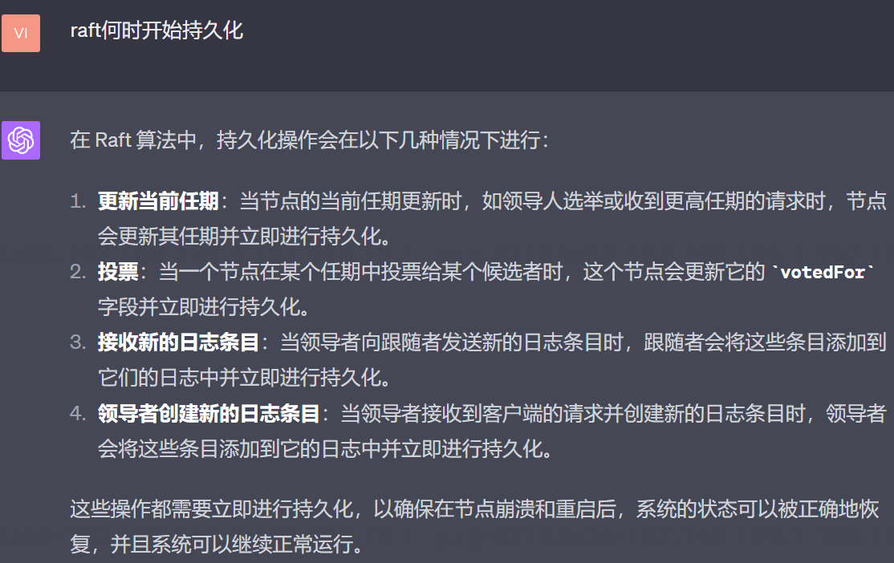

3 从节点也能应用状态机吗？

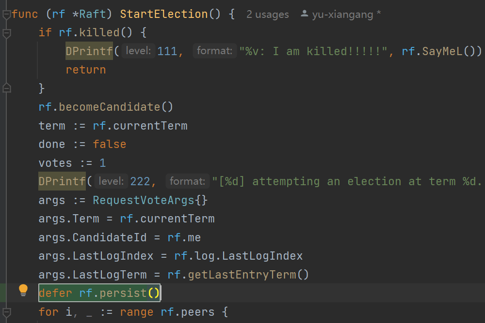

4 所以最终响应给用户指令是否执行成功的标志是状态机的执行标志吗？

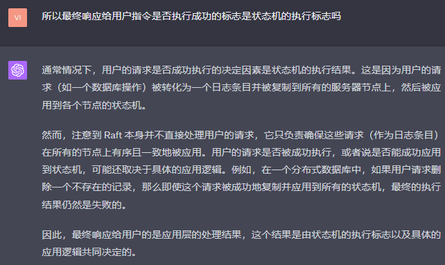

5 每一个节点都有一个状态机，那么指令是否执行成功是依据leader节吗还是所有节点？

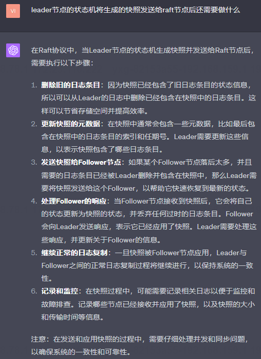

6 Leader节点一般会在何时会向客户端响应指令执行成功或者失败呢？

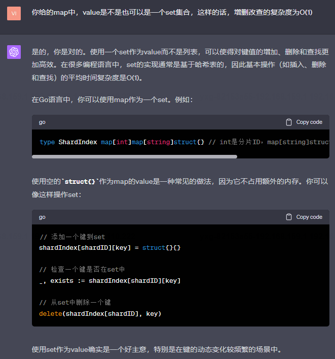

7 为什么不是在各个节点应用指令到状态机之后，主节点再返回正误呢？

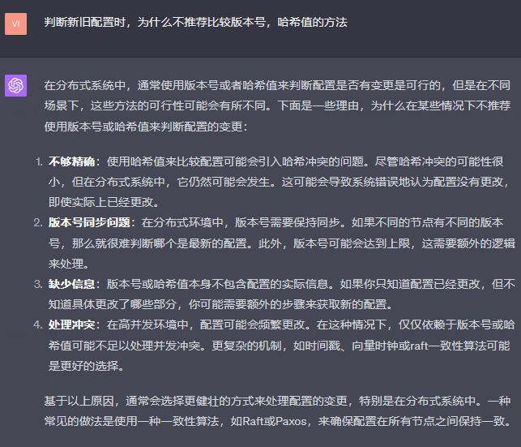

8 **如果raft系统是后端服务器，那么它的客户端是谁？**

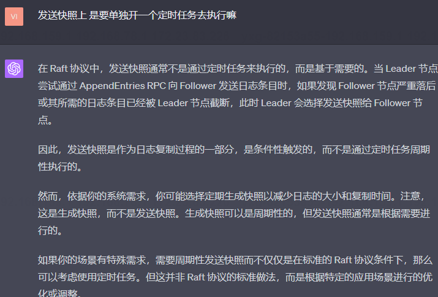

9 作为raft的客户端，讲讲分布式文件系统中的客户端和raft系统的交互流程。
（1）这里的分布式文件系统是说每一个节点最终都存储了相同的内容吗

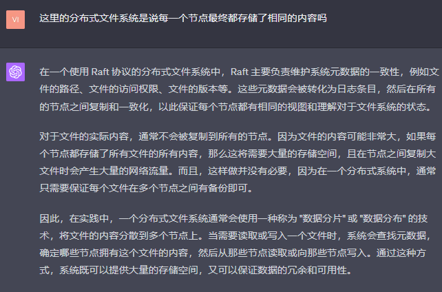

（2）可不可以这样理解，每一个数据分片相当于一个主从备份集群，然后每一个raft系统布局在这个集群中

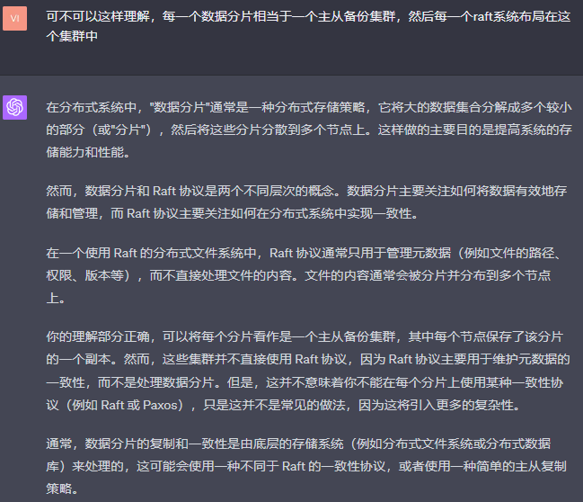

（3）raft是怎么管理分布式文件系统的元数据的？

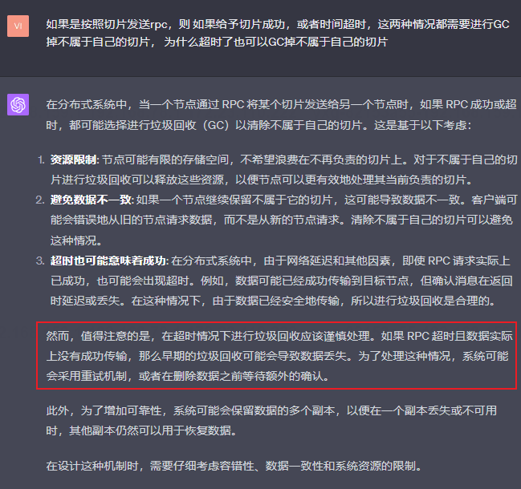


10 作为raft的客户端，微服务中的客户端和raft系统的交互流程。


11 作为raft的客户端，redis如何与raft系统交互

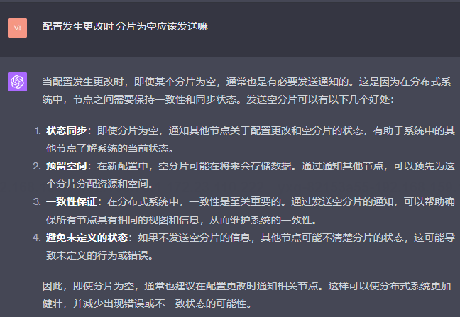

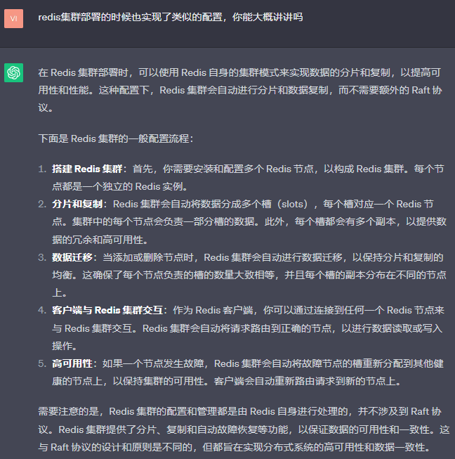

12 各个节点的状态机之间会有联系吗？

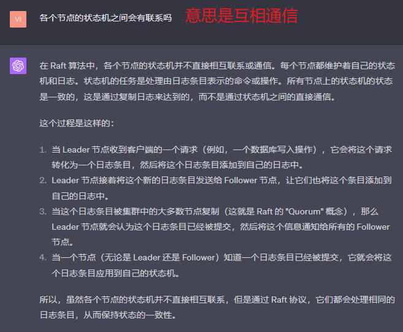

13 本项目中存在状态机吗？
> 答：存在，本项目的状态机其实就是tester程序（test_test.go），用来校验我们撰写的raft程序是否正确，
> raft论文里规定每一个节点数据结构都有lastApplied字段，每一个节点的该字段的更新都靠一个独立的协程来
> 负责，相当于每一个节点都有一个状态机（应用程序）。

14 如果命令执行成功或者失败后需要响应客户端，规则是什么，如何实现？
> 假如这里的raft系统的客户端是redis的客户端，我使用这个客户端向redis主从集群插入一条a=1的数据，
> 那么这条数据会被优先打到leader节点，但是leader节点不会立即去执行插入操作，而是先将其保存成
> 日志的形式放到本地内存中index=1处，并且发送给其他从节点，当leader节点确认大多数节点已经存储了这个日志
> 后就会提交commitIndex=1，当其他节点得知leader已经提价了该日志后也会提交commitIndex=1,此时就可以
> 响应redis客户端执行成功的消息了，而不需要等状态机应用了这个插入命令后才返回，**即使状态机应用错误，那也一定是
> 因为网络环境，机器故障，或者指令本身的逻辑错误。**
> 

## Q2 
提交日志的流程及其说明
1 主结点以及各个从节点的commitIndex是如何更新的？

> 答：**首先可以确定是的主节点的commitIndex不依赖于各个从节点的commitIndex,
而是依赖matchIndex但是从节点更新commitIndex时依赖主节更新的commitIndex.**
主结点将AppendEntries rpc发给从节点，从节点收到后会更新日志，然后返回给leader节点成功同步，
leader节点将从节点的prevLogIndex赋值给主结点中存储的属于该从节点的matchIndex，每次收到
日志复制成功的响应，就尝试提交一次等于matchIndex的日志索引，主结点日志提交成功的条件就是集群中多数节点的
这个matchIndex已经被提交，具体的判断逻辑可以参考tryCommitL方法实现。
>
> 至于从节点地commitIndex更新，在主结点发送AppendEntries RPC给自己时，如果成功添加或者覆盖了日志
> 则一定要更新一次自己地commitIndex，如果主节点的commitIndex大于从节点的commitIndex，则取
> min(LeaderCommit, rf.log.LastLogIndex)，因为在集群中可能存在从节点的日志复制速度还跟不
> 上主结点的的日志提交速度，这里一定只有少数从节点跟不上主结点日志的提交速度(一致性容错原则决定
> 最低有一半节点的matchIndex都大于等于x才有可能使得commitIndex=x的日志得以提交)
>

```go

if args.LeaderCommit > rf.commitIndex {
    if args.LeaderCommit < rf.log.LastLogIndex {
        rf.commitIndex = args.LeaderCommit
    } else {
        rf.commitIndex = rf.log.LastLogIndex
    }
    rf.applyCond.Broadcast()
}

```


2 为什么所有从节点的commitIndex要依赖于leader的commitIndex呢？
>答：首先主从架构下，只有leader节点能接受写操作，leader模式写成功的条件是集群中大多数
> 节点的matchIndex大于等于主结点的commitIndex,此时主结点可以认为在commitIndex这个
> 索引上大多数节点的日志条目是一样的，但是如果集群中多数节点挂了，则无法获取到多数票，此时
> commitIndex会提交失败，又因为从节点的commitIndex依赖于leader节点，所以所有的从节点
> 此时不会提交各自的commitIndex，然后主结点就可以给客户端返回操作失败，这样也是保证了
> 一致性的。
>
> 如果从节点的commitIndex不依赖于leader的commitIndex，则发生故障时，
> 主节点的commitIndex不能提交成功（因为多数节点故障，只有少数票不足以提交日志），但是
> 未故障的从节点却可以提交commitIndex, 此时出现了主从不一致现象，因为从节点的
> commitIndex一定小于等于主节点的commitIndex

2 tryCommitL方法实现（有多少服务器认为日志条目已提交?）
```go
// 主节点进行提交，其条件是多余一半的从节点的commitIndex>=leader节点当前提交的commitIndex
func (rf *Raft) tryCommitL(matchIndex int) {
    if matchIndex <= rf.commitIndex {
        // 首先matchIndex应该是大于leader节点的commitIndex才能提交，因为commitIndex及其之前的不需要更新
        return
    }
    // 越界的也不能提交
    if matchIndex > rf.log.LastLogIndex {
        return
    }
    if matchIndex < rf.log.FirstLogIndex {
        return
    }
    // 提交的必须本任期内从客户端收到的日志
    if rf.getEntryTerm(matchIndex) != rf.currentTerm {
        return
    }

    // 计算所有已经正确匹配该matchIndex的从节点的票数
    cnt := 1 //自动计算上leader节点的一票
    for i := 0; i < len(rf.peers); i++ {
        if i == rf.me {
            continue
        }
        // 为什么只需要保证提交的matchIndex必须小于等于其他节点的matchIndex就可以认为这个节点在这个matchIndex记录上正确匹配呢？
        // 因为matchIndex是增量的，如果一个从节点的matchIndex=10，则表示该节点从1到9的子日志都和leader节点对上了
        if matchIndex <= rf.peerTrackers[i].matchIndex {
            cnt++
        }
    }
    // 超过半数就提交
    if cnt > len(rf.peers)/2 {
        rf.commitIndex = matchIndex
        if rf.commitIndex > rf.log.LastLogIndex {
            DPrintf(999, "%v: commitIndex > lastlogindex %v > %v", rf.SayMeL(), rf.commitIndex, rf.log.LastLogIndex)
            panic("")
        }
        DPrintf(199, "%v: rf.applyCond.Broadcast(),rf.lastApplied=%v rf.commitIndex=%v", rf.SayMeL(), rf.lastApplied, rf.commitIndex)
        rf.applyCond.Broadcast() // 通知对应的applier协程将日志放到状态机上验证
    } else {
        DPrintf(199, "\n%v: 未超过半数节点在此索引上的日志相等，拒绝提交....\n", rf.SayMeL())
    } 
}
```
3 为什么需要matchIndex？

> 答：首先我们需要知道matchIndex的含义是从节点和主结点的日志匹配索引，raft机制规定主结点提交一个commitIndex
就表示在该commitIndex处及其之前的日志记录都已被提交，同时提交commitIndex的条件是集群内在这个索引下的
多数节点（也包括leader节点）的日志都是相同的，如何知道一个从节点日志和主节点日志的匹配进度呢？答案就是使用
matchIndex，leader节点存储了每一个从节点的matchIndex，所以每次当leader节点成功的同步了一部分日志到
某一个从节点的时候就会开启一个协程去处理主结点的提交索引问题，可能刚开始的时候会失败，但是随着越来越多的从节点
的matchIndex达到了最新的日志末尾，总有一次多数matchIndex大于等于commitIndex，此时可以提交。
具体的流程可以参考2.


## Q3 
问：leader发送给各个从节点的prevLogIndex的值等于nextIndex-1还是leader节点的lastLogIndex呢

> 答： 
因为leader节点要同步给从节点的日志是从nextIndex开始的，如果一开始prevLogIndex值很大，
同步到第一次发生不匹配的索引会经过多次rpc请求和响应操作，会耗费时间。
当一个从节点刚刚转为leader时，它的nextIndex[i]数组元素会被更新为rf.log.LastLogIndex + 1，但是
leader节点可能还会不断地从客户端接收新日志，这个时候nextIndex可能小于leader日志的lastLogIndex，
这就是关键，首先我们可以确定刚刚转为leader地时候，从客户端收到地日志只可能被主结点写入日志中，而且在
主结点更新到从节点之前从节点一定是没有存储新增地日志，所以没必要让它取较大的那个值，取最大值也可以，
但是这样会增加“请求-回应”的次数以使得nextIndex最终收敛，具体的为什么要等到nextIndex收敛需要参考
具体实现请参考AppendEntries2和HandleAppendEntriesRPC2

当然还有一种就是论文中提到地优化：具体实现请参考AppendEntries2和HandleAppendEntriesRPC2
> 答：因为当leader节点会把发送方日志的lastLogIndex位置开始的后面所有日志都发送给从节点，
当nextIndex中存储的索引小于接收方的lastLogIndex时，只需要比较它们对应日志项的任期是
否一致就行，如果一致，对于处在nextIndex到接收方的lastLogIndex索引之间的日志采用覆盖写，
对于大于lastLogIndex索引的日志部分，采用追加写即可.
> 
> 其次，因为每次新leader当选时都会重置各个节点的nextIndex=rf.log.LastLogIndex + 1
> ，matchIndex = 0，所以lastLogIndex和它的nextIndex也没有差别太大。rpc携带的
> 数据项也不会太多


## Q4
当一个leader崩溃，需要选出新leader的时候，除了term和candidateId，
Candidate节点需要发送prevLogIndex以及prevLogTerm给follower节点，
此时的prevLogIndex=lastLogIndex，为什么不是commitIndex，而且lastLogIndex
不是包含了一些未提交的节点吗？

> 答：首先我们需要理解commitIndex和lastLogIndex是互相独立的两个东西，
也就是说更新一个主结点的commitIndex和lastLogIndex的更新是两个协程在进行。
选举工作以及从节点的日志更新工作都不会用到commitIndex，commitIndex是用来确认
当前的提交工作已经进行到哪儿了，commitIndex永远小于等于lastLogIndex

## Q5 

从节点对待leader节点发送过来的日志的具体处理流程以及
怎么从定时器的角度实现一个nextIndex的收敛过程？

> 答：可以和心跳公用一个定时器，心跳是每隔110ms就发送一次，假设在属于leader的ticker协程中，
cpu每隔50ms轮询一次心跳是否过期，如果过期就只发送心跳，以维护自己的leader地位，假如探测到没有过期，
则发送leader中复制日志rpc到所有从节点的，发送的时候会带上自己的PrevLogIndex，PrevLogTerm，
> leaderTerm, commitIndex以及在索引PrevLogIndex之后的日志条目。
>
> 下面是一个从节点的判断流程：
>
> 首先会判断PrevLogIndex是否越界(PrevLogIndex<FirstLogIndex || PrevLogIndex>rf.LastLogIndex)，
> 如果越界则返回false从节点同时返回主结点自己的rf.LastLogIndex以及rf.LastLogTerm，主结点随后会
> 在随后的AppendEntries RPC请求中会将从节点返回的LastLogIndex位置上的及其后面的日志发送给该从节点
>
> 如果PrevLogIndex没有越界(PrevLogIndex>=FirstLogIndex && PrevLogIndex<=rf.LastLogIndex)，
> 则从节点会先判断在该索引上的日志的任期是否等于args.PrevLogTerm，
> 如果等于则会可以执行日志覆盖或者添加操作。具体的流程是会逐项遍历主结点发过来的日志,
> 对于处于PrevLogIndex到LastLogIndex的日志项，
> 对于每一项，如果发现有主结点的对应日志的任期号和自己该索引上日志的任期号不一致，则覆盖该项日志，否则比较下一项
> 对于大于LastLogIndex的日志项，会执行append操作将日志项添加到自身的日志末尾。从节点随后会更新自己的commitIndex
>
> 如果从节点在索引PrevLogIndex上的日志的任期不等于args.PrevLogTerm，如果采用nextIndex递减算法，则响应参数
> 跟(PrevLogIndex<FirstLogIndex || PrevLogIndex>rf.LastLogIndex)的情况是一样的（HandleAppendEntriesRPC2
> 和HandleAppendEntriesRPC2 搭配使用实现）； 如果采用优化的nextIndex跳跃算法，可以参考（HandleAppendEntriesRPC
> 和HandleAppendEntriesRPC的搭配）这两种算法的复现过程可以看Q8
>
> 从一个leader节点来看：
>
> 首先会设置请求体，包括自己的任期号，commitIndex，PrevLogIndex, PrevLogTerm以及PrevLogIndex后的日志项，
> 发给从节点后，如果从节点成功复制了日志，则返回true给主节点，这个时候主节点可以更新自己的数据结构中关于该从节点的
> matchIndex和commitIndex，随后会尝试一次将matchIndex传入状态机中，更新lastApplied字段。
>
> 如果leader收到了失败信息，则看看是不是自己的任期过小，则更新任期，角色转换为follower，再等待集群中选举出新leader

> 问：对于基础方法（官方给出）Start，有必要在每一次生产出一个日志给主节点后发送一次AppendEntries RPC
吗？
>
> 答：最好是要，因为能够以最快的速度将主节点的日志扩散至从节点。


## Q6 
对于下面这幅图，如果此时leader崩溃，最终选出了有未提交日志的节点d作为leader，
那么此时的日志复制过程是怎样的？d未提交的日志11和12，是被leader丢弃吗还是会
扩散到其他从节点？如果被丢弃是不是违背了“只有从节点可以日志回退”的特性，如果
扩散，是不是会把未提交的日志扩散到从节点，造成了数据不一致？

答：首先当leader节点确认已提交时必然是集群中过半节点都提交了该日志，此时可以leader
可以向用户节点返回true，否则返回false，对于false来说就是失败了，但是可能leader
节点中可能还存在该未提交的日志项，此时的日志项是无用的。


## Q7 
如何理解论文5.3节下面这句话（涉及到日志接收处理逻辑）：

> a follower may be missing entries that are present on the leader, it may
have extra entries that are not present on the leader, or
both
> 
> 翻译：从节点可能会丢失在新Leader节点上存在的条目，它可能有额外的未提交的条目但是没有出现在
> Leader节点上，或者两种情况可能同时发生在一个从节点上

1 从节点可能会丢失在新Leader节点上存在的条目：

> 这种情况大概就是一个Leader节点向对等节点发送了一个AppendEntries请求，
其中有一部分从节点提交到了日志并且经过了复制状态机的验证（日志保存完毕且commitIndex得到更新），但是也有一部分节
点还没来得及通过复制状态机验证正确性，此时leader节点也没有
收到大多数的从节点的响应信息，所以本机上的日志条目没有提交（日志中会保
留数据但是commitIndex的值没来得及更新），当这个leader节点崩溃后，新
的leader节点会出现，新leader会重新发送AppendEntries RPC给从节点，
收到响应后的从节点会直接将不匹配的日志起始位置发送给新leader，新leader
会据此更新自己数据结构中的matchIndex和nextIndex然后新leader再发送各
个从节点中缺少的部分日志，就这样日志达到了一致性。


2 从节点可能有额外的但是新leader节点上找不到的日志条目（从节点上有额外未提交的日志条目)

> 这种情况大概就是一个Leader节点A收到用户的添加日志信息后，立即先存储到本地（但是没有更新commitIndex），
然后向所有对等节点发送了一个AppendEntries请求， 但是在所有节点都收到这些rpc请求，
此时leader节点崩溃，随后新的leader节点B会产生，旧的leader可能在新任期下成为从节点，
此时的主节点B的本地日志记录数是小于从节点A的日志记录数的。此时当新Leader节点A发送
AppendEntries给旧leader时，旧leader会将自身最后一个日志条目索引和新leader的进行比较，
会发现大于新leader，于是将大于的部分所表示的日志给删除掉，这个时候一致性就得到了保证。

可能大家会问为什么这个时候旧leader未提交的日志条目要被删除而不是把它捡回来呢？
> 答：我们认定，如果用户向主结点发送的写请求最终没有提交，那么主结点会返回给用户一个错误，
这个时候虽然服务不可用但是仍然保证了数据一致性。所以这个时候把未提交的数据进行删除操作
也不影响一致性，因为系统默认了这个失败

3 两种情况可能同时发生在一个从节点上的场景 - 一个从节点既有可能存在未提交的日志条目，
也可能存在缺失的日志条目

> 如果该服务器是领导者，对于term 2，在其日志中添加了几个条目，然后在提交之前崩溃 
> ;它很快重新启动，在term=3时成为leader，并且又在它的日志中增加了一些项并且提交了
> term=2时的日志，但是term=2的日志并没有存在于其他的节点中，
> 而且在准备提交term=3产生的日志之前服务器再次崩溃，直到又经过了好几个任期才上线，此时
> 该节点的状态就如下图的f节点所示。
>


问：出现这三种情况如何设计rpc调用与响应以保持数据一致性？


> 答：解决方案都在上面这个图中，首先我们可以确定的是，选举leader节点会比较各个节点的lastLogIndex
> ，最后选出的一定是lastLogIndex最大的那个节点，所以新leader结点一产生就会立马发送自己的日志
信息给从节点，携带的信息包括发送方的LeaderCommit（leader的日志提交索引-commitIndex），
PrevLogIndex（对等节点的nextIndex-1），PrevLogTerm，接收方收到这些信息后，会采取以下动作：
如果leader的任期小于自身任期，则返回错误，

Figure7即本问题的第一张图提供了2.1，2.2以及2.3同时发生的场景，所以我们按照第二张图
试着走一遍leader节点向a~f节点发送AppendEntries以解决日志不同步问题的的流程，

> 对于节点a，收到Leader的日志更新rpc后会发现其任期比自己的大，并且其PrevLogIndex和prevLogTerm
与自己的lastLogIndex及对应的任期是一摸一样的，随后又发现其request请求中携带了新的日志条目，所以
会把这个日志条目追加进自己的本地日志中，最后再通过公式
计算commitIndex=min(leaderCommit, index of last new entry)

> 对于节点b，收到leader的信息后，发现任期比自己大但是其PrevLogIndex比自己的lastLogIndex大，
> 所以会返回false给主结点，主结点收到后将peerTracks中存储的该从节点的nextIndex的值自减1，然后再
> 将这个自减后的index赋值给PrevLogIndex，找到其日志并且再次发送AppendEntries RPC给接收方，
> 接收方再次比对任期号，index以及该index对应的日志条目的term后，发现还是不匹配，于是再发送false给
> 主节点，主结点再自减1，重复以上流程直到主结点中记录的该从节点的nextIndex-1位置上的日志条目和
> 从节点该位置上的条目相等，此时从节点发现任期号，索引号以及索引位置上存放的日志的任期号都与leader
> 节点发过来的相等，则此时会先删除nextIndex位置及其后面的日志条目并且将leader发过来的日志条目都
> 补上去，随后再发送true响应给主节点，这时leader更新matchIndex即可，这样大家leader节点和从节点b的一致性得到了保证
> 
> 问：为什么不直接用matchIndex一次性将其后的日志打给从节点？
> 答：首先只有leader节点的matchIndex是会被实时更新和使用的，然后当一个leader刚刚更新完matchIndex后断联了，
> 随后的某个任期它又重新当选leader，那么重新当选leader时的matchIndex会被置为0，表示没有匹配的项，
> 如果一次性将所有日志都打给从节点，那么网络I/O时间过长。
>
> 问：为什么当选leader后需要初始化matchIndex呢？
> 答：这是因为matchIndex只是为了主结点提交commitIndex而设置的，nextIndex是为了最终确定matchIndex而设置的交互变量。
>
> 问：matchIndex是不是始终等于nextIndex-1呢？
> 答：显然不是，比如上面回答提到的leader初始化时会设置matchIndex=0，但是nextIndex会被初始化为lastLogIndex，
> 如果是某一个节点在已经接受了部分复制的时候成为新任期的leader时，nextIndex肯定不止比matchIndex大1.  

> 对于节点c，leader首次发送过来的PrevLogIndex是10，term为6，经过对比发现本地日志中索引为10的日志
> 对应的任期也是6，于是从节点可以判定本地日志从索引11开始到末尾都是无效的可以删除，然后返回true给leader，
> leader收到后更新nextIndex和matchIndex
> 
> 问：此处有一个疑问，此时c节点的commitIndex已经是11了，为什么不覆盖11呢？
> 我认为应该覆盖索引11上的日志的理由（主观臆断的）：
> 
> 答：因为这里从节点的索引为11的日志只有这一个节点中存储着，这意味着保证一致性的条件就不成立
>（集群中必须有一半以上的节点存储着这个key才能保证安全性或者说一致性），节点c的索引11所代
> 表的日志只有本机节点存储了，这也是为什么它不被选为leader的原因，这个集群中包括leader共有
> 7个节点，也就说要即使3台主机宕机了，整个集群也能正常工作，这就要求一个日志最低存储在四台主
>机上才能保证可用性服务，
> 反驳理由：
> 可以参考Q7的第5点，那个case和这个场景很像，已经写的很详细了


> 对于节点d，leader首次发送过来的PrevLogIndex是10，term为6，发现对应的上，发现都对应上了，
> 但是没有更新的数据

> 对于节点e，与节点b和leader的交互过程类似，直到PrevLogIndex递减到4时，leader才会把达e缺失的后面的数据一次性全发过来

> 对于节点f，从PrevLogIndex从11递减到4的这个阶段，都是从节点和主节点对应日志索引上的任期不同导致的

4 还是Q7中的第一幅图，如果此时leader崩溃了，而d节点成为了新的leader，此时d节点的未提交日志
是如何被处理的？

> 答：此时节点c中未提交的日志也会被扩散到从节点，如果在某一刻集群内多数节点接收到了这个日志，则更新
> commitIndex到这个日志所在的index

> 问：那如果d节点没有成为新的leader节点呢，d中未提交的日志命运如何？
> 
> 答：此时d中未提交的日志项会被从leader节点接收的新的条项覆盖

5  论文中提到的下面这个场景为什么会出现？如何在代码或者rpc通信流程中体现出来

> If an existing entry conflicts with a new one (same index
but different terms), delete the existing entry and all that
follow it
> 
> 翻译：如果现有条目与新条目冲突(相同的索引但不同的术语)，则删除现有条目及其后的所有条目


> 答：这是有可能出现的，旧leader的日志在任期1还没来得及提交就崩溃了，如果崩溃前主节点的commitIndex
是5，但是lastLogIndex是10，在新任期选举出的新leader的commitIndex一定也是5，lastLogIndex
可能是5到10中的任何一个，假设是7，那么新leader后续接收到的新的3个日志从8开始放置到10，当旧leader
重连网络后，新leader会发送的6到10的日志项到这个旧leader节点，那么这几个日志项的任期是不一样的，6，7的
任期是1，但是日志8，9，10的任期是2，
这个时候旧leader收到这5个日志项后是这样处理的，对待6，7因为其日志索引和任期与自己对应日志位置上的一摸一样，
所以会从索引8开始直到10的槽位才会被新leader的8到10的日志项覆盖。


## Q8：raft论文中介绍了两种确定nextIndex的rcp调用和响应算法，如何分别实现它们

1 论文中提到的是收敛速度较慢的算法，具体的核心思想如下：

> The leader maintains a nextIndex for each follower,
which is the index of the next log entry the leader will
send to that follower. When a leader first comes to power,
it initializes all nextIndex values to the index just after the
last one in its log (11 in Figure 7). If a follower’s log is
inconsistent with the leader’s, the AppendEntries consistency 
check will fail in the next AppendEntries RPC. 
after a rejection, the leader decrements nextIndex and retries
the AppendEntries RPC. Eventually nextIndex will reach
a point where the leader and follower logs match. When
this happens, AppendEntries will succeed, which removes
any conflicting entries in the follower’s log and appends
entries from the leader’s log (if any). Once AppendEntries
succeeds, the follower’s log is consistent with the leader’s,
and it will remain that way for the rest of the term.
> 
> 翻译：当一个节点刚成为leader时，它会初始化所有的nextIndex为lastLogIndex+1，
> 如果从节点的日志与leader节点的日志不一致, appendEntries rpc发到从节点后，
> 一致性检查会失败，所以会拒绝这个rpc，主结点收到会将nextIndex减去1然后再重新
> 向这个从节点发送appendEntries rpc，如果还拒绝再自减1再重试直到达到一个
> 主结点和该从节点的日志是一致的位置
HandleAppendEntriesRPC2和AppendEntries2这种方法的复现

测试结果： 测了两次，平均时间51s
```go
Test (2B1): basic agreement ...
... Passed --   0.8  3   20    6234    3
Test (2B2): RPC byte count ...
... Passed --   0.8  3   26   37940    4
Test (2B3): test progressive failure of followers ...
... Passed --   4.8  3  174   41709    3
Test (2B4): test failure of leaders ...
... Passed --   5.2  3  298   70101    3
Test (2B5): agreement after follower reconnects ...
... Passed --   5.7  3  192   57873    8
Test (2B6): no agreement if too many followers disconnect ...
... Passed --   3.7  5  276   67624    3
Test (2B7): concurrent Start()s ...
... Passed --   0.5  7   54   17521    6
Test (2B8): rejoin of partitioned leader ...
... Passed --   6.5  3  295   78061    4
Test (2B9): leader backs up quickly over incorrect follower logs ...
... Passed --  21.7  5 3360 2310784  105
Test (2B_10): RPC counts aren't too high ...
... Passed --   2.0  3   82   27825   12
PASS
ok      MIT6.824-6.5840/raft    52.400s

```
2 优化算法：
> If desired, the protocol can be optimized to reduce the
number of rejected AppendEntries RPCs. For example,
when rejecting an AppendEntries request, the follower
can include the term of the conflicting entry and the first
index it stores for that term. With this information, the
leader can decrement nextIndex to bypass all of the con-
flicting entries in that term; one AppendEntries RPC will
be required for each term with conflicting entries, rather
than one RPC per entry. In practice, we doubt this optimization 
> is necessary, since failures happen infrequently
and it is unlikely that there will be many inconsistent entries.
> 
>
> 翻译：起初时发送端的参数不变，但是在从节点发现不一致的时候，也会返回一个PrevLogIndex
> 和一个PrevLogTerm参数，这里的PrevLogIndex是从节点发生冲突的日志项所属的任期内的第一个
> 索引，而PrevLogTerm参数则是该索引对应的任期，这样主节点收到这种反馈后，nextIndex会直接
> 跳到这个任期的第一个索引，也就是说AppendEntries发送频率由每一次冲突日志的任期内需要一次rpc
> 调用，而不是每一个冲突的日志项会发生一次rpc调用。 主结点收到响应后也会往前跳跃一个任期，这样
> nextIndex的收敛速度进一步加快。可以参考HandleAppendEntriesRPC和AppendEntries
> 这种方法的复现


测试结果：两次平均44s，已经是巨大的进步了
```go
Test (2B1): basic agreement ...
  ... Passed --   0.8  3   20    6234    3
Test (2B2): RPC byte count ...
  ... Passed --   0.8  3   26   37940    4
Test (2B3): test progressive failure of followers ...
Test (2B3): test progressive failure of followers ...
  ... Passed --   4.8  3  174   41709    3
  ... Passed --   0.7  3   20    6234    3
Test (2B2): RPC byte count ...
  ... Passed --   0.8  3   26   37904    4
Test (2B3): test progressive failure of followers ...
  ... Passed --   4.7  3  176   42439    3
Test (2B4): test failure of leaders ...
  ... Passed --   5.3  3  304   72175    3
Test (2B5): agreement after follower reconnects ...
  ... Passed --   5.4  3  182   55043    8
Test (2B6): no agreement if too many followers disconnect ...
  ... Passed --   3.7  5  288   70904    3
Test (2B7): concurrent Start()s ...
  ... Passed --   0.5  7   60   18263    6
Test (2B8): rejoin of partitioned leader ...
  ... Passed --   4.4  3  240   60412    4
Test (2B9): leader backs up quickly over incorrect follower logs ...
  ... Passed --  16.0  5 2740 1898720  102
Test (2B_10): RPC counts aren't too high ...
  ... Passed --   2.1  3   82   28324   12
PASS
ok      MIT6.824-6.5840/raft    44.074s
```

## Q9 各个节点的状态机什么时候开始应用日志？
> 主从节点提交日志之后，就可以应用状态机了，但是主从节点的日志提交条件是不同的
，就具体的代码来说，主结点的commitIndex更新依赖于各个节点对应的matchIndex，
而从节点的commitIndex更新依赖于主节点的commitIndex
