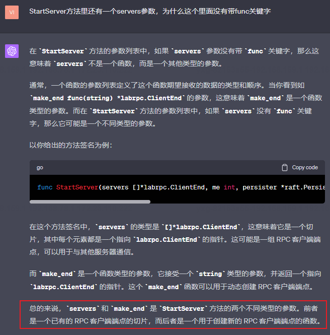

<h1 align="center">MIT6.5840（6.824）-Distributed-System Lab2C</h1>

The Lab2C's realization of MIT6.5840(also early called 6.824) Distributed System in Spring 2023

# 1 关于raft快照的一些Q&A

## 1.1 raft为什么要进行快照？


## 1.2 应该在什么时候进行快照呢


## 1.3 如何进行快照


## 1.4 如果需要给raft增加快照功能，是不是相当于给状态机也做了快照？


## 1.5 raft持久化包括快照吗


## 1.6 快照的时候会备份保存哪些数据


> 注意：该项目的快照的具体数据由tester实现，但是同步快照到从节点，从节点更新快照，
> 宕机后从快照中恢复数据（从持久化的快照中恢复数据是通过调用API方法做到）由我们实现
## 1.7 如果节点宕机，是读取持久化的数据时，是执行日志还是读取快照？


## 1.8 raft系统的快照的日志索引一般是小于等于leader的lastApplied字段吗？


## 1.9 leader节点地lastApplied字段有可能比从节点地该字段小吗


## 1.10 leader接收快照后，rf.commitIndex和rf.lastApplied字段如何修改


> 为什么一定要设置为不小于lastIncludedIndex的值呢？
> 答：因为有可能在执行快照到发生故障之前，节点可能会写入新的日志并且同步到多数节点当中，
> 并且也有可能应用到状态机中，这样rf.commitIndex和rf.lastApplied就会被更新，其值一定大于
> lastIncludedIndex，所以我们可以取两者之间最大值，或者不用设置也可以，因为这两个值会在leader
> 向从节点同步日志的时候自动更新。

```go
	rf.commitIndex = max(rf.commitIndex, index)
	rf.lastApplied = max(rf.lastApplied, index)

```


# 2 解析现有的代码结构和测试逻辑

## 2.1 本项目的快照的哪些功能需要我们实现呢？
> 本项目中快照的持久化，主结点读取状态机发送过来的快照数据以及将快照同步给
> 从节点的工作需要我们coding，至于从快照中恢复状态机的状态本lab中并不涉及，
> 因此在readPersist方法中，只涉及到解析普通命令类型的日志的数据，但是并没有
> 涉及到状态机数据的解析（虽然持久化的时候涉及到了保存状态机数据的操作），
> 这是因为数据是由状态机恢复（tester可以看作是一个状态及程序），所以不由我们实现。

## 2.2 这里的Snapshot方法体内需要编写什么代码？
> 我们看到Snapshot方法仅被一个config文件里的applierSnap方法调用，而applierSnap
> 方法用于被tester周期性的执行，
>
我们看看applierSnap方法体：

```go

// periodically snapshot raft state
// 一个是节点id，第二个是ApplyMsg的通道
// 通过前面的lab我们都知道applyCh通道是sendMsgToTester方法里
// 生成的，然后会传递给tester保存到本地的cfg.logs[i][j]中，可以
// 看到本方法中cfg.logs[i][j]有被使用
// 本方法是作为func (cfg *config) start1(i int, applier func(int, chan ApplyMsg))
// 的第二个参数使用的，具体的调用可以参考这个start1方法体，
// 在这个方法体里，applyCh参数来源于cfg.saved[i],这里包含了
// 持久化的日志，
// saved[i]是cfg保存持久化的属性，所以这里我们在实现持久化的时候
// 也需要对快照进行持久化，这样tester在进行故意崩溃一个节点并且
// 重连的时候能够调用这个方法进行快照恢复
func (cfg *config) applierSnap(i int, applyCh chan ApplyMsg) {
	cfg.mu.Lock()
	rf := cfg.rafts[i]
	cfg.mu.Unlock()
	if rf == nil {
		return // ???
	}
    // 每一个节点的applyHelper，applyHelper的
	// applyCh属性会被状态机不断地送入值，所以需要
	// 以循环方式遍历快照指令
	for m := range applyCh {
		err_msg := ""
		// 快照有效就读快照
		if m.SnapshotValid {
			cfg.mu.Lock()
			err_msg = cfg.ingestSnap(i, m.Snapshot, m.SnapshotIndex)
			cfg.mu.Unlock()
		} else if m.CommandValid {
			// 命令有效就
			if m.CommandIndex != cfg.lastApplied[i]+1 {
				err_msg = fmt.Sprintf("server %v apply out of order, expected index %v, got %v", i, cfg.lastApplied[i]+1, m.CommandIndex)
			}

			if err_msg == "" {
				cfg.mu.Lock()
				var prevok bool
				err_msg, prevok = cfg.checkLogs(i, m)
				cfg.mu.Unlock()
				if m.CommandIndex > 1 && prevok == false {
					err_msg = fmt.Sprintf("server %v apply out of order %v", i, m.CommandIndex)
				}
			}

			cfg.mu.Lock()
			cfg.lastApplied[i] = m.CommandIndex
			cfg.mu.Unlock()

			if (m.CommandIndex+1)%SnapShotInterval == 0 {
				w := new(bytes.Buffer)
				e := labgob.NewEncoder(w)
				e.Encode(m.CommandIndex)
				var xlog []interface{}
				for j := 0; j <= m.CommandIndex; j++ {
					xlog = append(xlog, cfg.logs[i][j])
				}
				e.Encode(xlog)
				rf.Snapshot(m.CommandIndex, w.Bytes())
			}
		} else {
			// Ignore other types of ApplyMsg.
		}
		if err_msg != "" {
			log.Fatalf("apply error: %v", err_msg)
			cfg.applyErr[i] = err_msg
			// keep reading after error so that Raft doesn't block
			// holding locks...
		}
	}
}

```

# 3 本项目一些具体的快照逻辑

## snapshot函数的作用
> 这是leader应用快照以及发送快照给所有从节点的入口函数，该函数由tester 测试程序调用，
> tester负责将快照好的数据传递给leader主机，leader更新完自己的日志FirstLogIndex
> 信息以及对快照进行持久化之后就会将快照数据传递给所有从节点的。

## snapshot函数中的leader节点应用快照信息的流程

leader节点收到快照后的步骤大概是
1. 更新快照信息,lastIncludeIndex,lastIncludeTerm以及snapshot
2. 更新日志的起始尾索引，并且截断或者清空日志
3. 更新日志相关的参数commitIndex，状态机相关的lastApplied
4. 持久化快照和日志
5. 将快照发送给所有从节点

下面的方法写了具体的注释，可以参考
```go
// 两个参数，一个是日志的index，一个是持久化后的snapshot字节数组, 这里的index其实就是lastIncludedIndex
// 这个方法应该就是发生故障重启后进行快照恢复的执行过程
func (rf *Raft) Snapshot(index int, snapshot []byte) {
	// Your code here (2D).
	DPrintf(111, "begin installSnapshot:")
	rf.mu.Lock()
	defer rf.mu.Unlock()
	// leader才能负责讲快照分发给从节点
	if rf.state != Leader {
		return
	}
	DPrintf(111, "%v: come Snapshot index=%v", rf.SayMeL(), index)
	// 确保日志索引没有越界
	if rf.log.FirstLogIndex <= index {
		if index > rf.lastApplied {
			panic(fmt.Sprintf("%v: index=%v rf.lastApplied=%v\n", rf.SayMeL(), index, rf.lastApplied))
		}
		// leader先更新自己的快照，以及快照对应的日志索引和任期
		rf.snapshot = snapshot
		rf.snapshotLastIncludeIndex = index
		rf.snapshotLastIncludeTerm = rf.getEntryTerm(index)

		// 因为一旦使用了快照，就需要删除前面的所有日志，物理上的日志开始索引变成了当前的快照索引+1
		newFirstLogIndex := index + 1
		if newFirstLogIndex <= rf.log.LastLogIndex {
			// 截取从newFirstLogIndex开始的子日志 等价于删除包括index及其之前的日志
			rf.log.Entries = rf.log.Entries[newFirstLogIndex-rf.log.FirstLogIndex:]
		} else {
			// 如果新日志索引比当前日志中的索引上界还大，则更新上界值为lastIncludedIndex
			// 这种情况只会发生在日志为空的情况下，因为日志为空，LastLogIndex=FirstLogIndex-1
			rf.log.LastLogIndex = newFirstLogIndex - 1
			rf.log.Entries = make([]Entry, 0)
		}
		rf.log.FirstLogIndex = newFirstLogIndex
		// 如果一个leader崩溃，新leader被选出时，其commitIndex很有可能是落后于旧leader的commitIndex
		// 因为从节点的commitIndex取决于leader的commitIndex,
		// 而leader的commitIndex很有可能作为快照的snapshotLastIncludeIndex
		rf.commitIndex = max(rf.commitIndex, index)
		// lastApplied字段永远小于等于commitIndex，所以
		// 新leader被选出时，其lastApplied很有可能是落后于旧leader的lastApplied
		// 原因同上面的rf.commitIndex一样
		rf.lastApplied = max(rf.lastApplied, index)
		DPrintf(111, "%v:进行快照后，更新commitIndex为%d, lastApplied为%d, "+
			"但是snapshotLastIncludeIndex是%d", rf.SayMeL(), rf.commitIndex, rf.lastApplied, rf.snapshotLastIncludeIndex)
		rf.persist() // 将其持久化
		// 将快照发送给所有从节点
		for i := 0; i < len(rf.peers); i++ {
			if i == rf.me {
				continue
			}
			go rf.InstallSnapshot(i)
		}
		DPrintf(11, "%v: len(rf.log.Entries)=%v rf.log.FirstLogIndex=%v rf.log.LastLogIndex=%v rf.commitIndex=%v  rf.lastApplied=%v\n",
			rf.SayMeL(), len(rf.log.Entries), rf.log.FirstLogIndex, rf.log.LastLogIndex, rf.commitIndex, rf.lastApplied)
	}
}
```
## 从节点收到leader的快照后应该执行的处理逻辑
1. 判断任期，请求任期小于自己则返回
2. 判断请求携带的lastIncludeIndex是否大于自身的lastIncludeIndex，
   大于则进行3，否则返回
3. 依据lastIncludeIndex截断日志并且更新日志的首尾项索引，
   FirstLogIndex和LastLogIndex
4. 应用快照到自己的状态机，并且更新自己的状态机应用状态字段-rf.lastApplied
5. 更新commitIndex并且持久化数据

更具体地可以参考HandleRequestInstallSnapshot方法

## 主结点发送快照给从节点并且收到从节点的响应后如何操作？
1. 如果从节点的任期大于自己的，则转变为follower并且return
2. 否则说明从节点接受了快照，此时leader需要更新对应从节点的数据结构的nextIndex
   和matchIndex分别为lastIncludeIndex+1和lastIncludeIndex
3. 提交该matchIndex

## 本项目中，哪些时候应该leader应该往从结点中发送快照信息
>

## 本项目保存状态机信息，配置元数据，以及日志索引及任期号作为快照的时候，具体怎么保存？
>

## 为什么本项目中关于 if rf.state != Leader在枷锁后都需要再判断一次？

# 4 日志复制的过程和快照发送与生成的关系

> 这里生成快照由tester程序帮我做，但是发送快照到从节点需要我们自己想，
> 这里一般是主从日志复制的交互过程中会产生发送快照的操作，
> （1）如果从节点
> 对appendEntries RPC的响应体中的prevLogIndex字段小于leader节点
> 的lastIncludedIndex字段，则需要将快照发送给从节点，
> （2）如果主结点的日志被清空（可能是因为执行了快照操作），也需要执行
> 一次快照操作。

# 5 持久化和快照的关系

## 5.1 每次持久化时，选择对日志持久化呢还是对快照持久化？怎么选?



一般肯定是开两个线程分别对日志和快照进行持久化，但是这里只提供一个持久化入口，
所以需要我们组合一下持久化日志和快照

但是在本lab的persist方法中，我们还是需要探讨一下什么时候持久化日志，什么
时候持久化快照，什么时候两个都做，因为是相当于单线程处理两种持久化的事情，

这里会依据持久化索引lastIncludedIndex，如果大于0则两者都持久化（
说明有快照），否则只持久化日志, 
