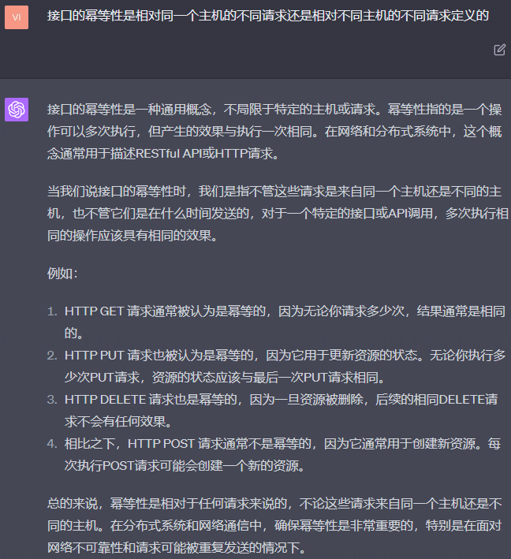
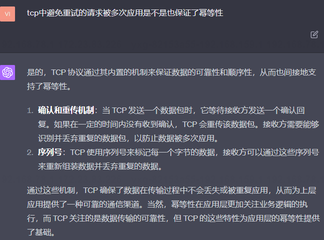
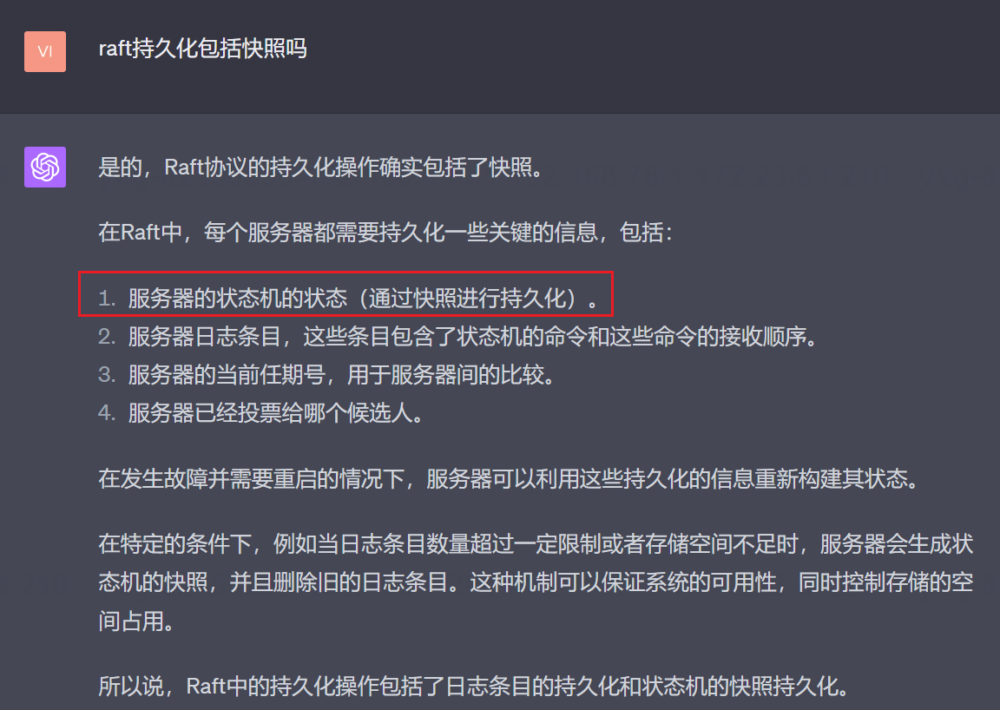

<h1 align="center">MIT6.5840（6.824）-Distributed-System Lab2C</h1>

The Lab2C's realization of MIT6.5840(also early called 6.824) Distributed System in Spring 2023

# 1 关于raft快照的一些Q&A

## 1.1 raft为什么要进行快照？


## 1.2 应该在什么时候进行快照呢


## 1.3 如何进行快照




## 1.4 如果需要给raft增加快照功能，是不是相当于给状态机也做了快照？


## 1.5 raft持久化包括快照吗



# 解析现有的代码结构和测试逻辑

## 本项目的快照的哪些功能需要我们实现呢？
> 本项目中快照的持久化，主结点读取状态机发送过来的快照数据以及将快照同步给
> 从节点的工作需要我们coding，至于从快照中恢复状态机的状态本lab中并不涉及，
> 因此在readPersist方法中，只涉及到解析普通命令类型的日志的数据，但是并没有
> 涉及到状态机数据的解析（虽然持久化的时候涉及到了保存状态机数据的操作），
> 这是因为数据是由状态机恢复（tester可以看作是一个状态及程序），所以不由我们实现。

## 这里的Snapshot方法体内需要编写什么代码？
> 我们看到Snapshot方法仅被一个config文件里的applierSnap方法调用，而applierSnap
> 方法用于被tester周期性的执行，
> 
我们看看applierSnap方法体：

```go

// periodically snapshot raft state
// 一个是节点id，第二个是ApplyMsg的通道
// 通过前面的lab我们都知道applyCh通道是sendMsgToTester方法里
// 生成的，然后会传递给tester保存到本地的cfg.logs[i][j]中，可以
// 看到本方法中cfg.logs[i][j]有被使用
// 本方法是作为func (cfg *config) start1(i int, applier func(int, chan ApplyMsg))
// 的第二个参数使用的，具体的调用可以参考这个start1方法体，
// 在这个方法体里，applyCh参数来源于cfg.saved[i],这里包含了
// 持久化的日志，
// saved[i]是cfg保存持久化的属性，所以这里我们在实现持久化的时候
// 也需要对快照进行持久化，这样tester在进行故意崩溃一个节点并且
// 重连的时候能够调用这个方法进行快照恢复
func (cfg *config) applierSnap(i int, applyCh chan ApplyMsg) {
	cfg.mu.Lock()
	rf := cfg.rafts[i]
	cfg.mu.Unlock()
	if rf == nil {
		return // ???
	}
    // 每一个节点的applyHelper，applyHelper的
	// applyCh属性会被状态机不断地送入值，所以需要
	// 以循环方式遍历快照指令
	for m := range applyCh {
		err_msg := ""
		// 快照有效就读快照
		if m.SnapshotValid {
			cfg.mu.Lock()
			err_msg = cfg.ingestSnap(i, m.Snapshot, m.SnapshotIndex)
			cfg.mu.Unlock()
		} else if m.CommandValid {
			// 命令有效就
			if m.CommandIndex != cfg.lastApplied[i]+1 {
				err_msg = fmt.Sprintf("server %v apply out of order, expected index %v, got %v", i, cfg.lastApplied[i]+1, m.CommandIndex)
			}

			if err_msg == "" {
				cfg.mu.Lock()
				var prevok bool
				err_msg, prevok = cfg.checkLogs(i, m)
				cfg.mu.Unlock()
				if m.CommandIndex > 1 && prevok == false {
					err_msg = fmt.Sprintf("server %v apply out of order %v", i, m.CommandIndex)
				}
			}

			cfg.mu.Lock()
			cfg.lastApplied[i] = m.CommandIndex
			cfg.mu.Unlock()

			if (m.CommandIndex+1)%SnapShotInterval == 0 {
				w := new(bytes.Buffer)
				e := labgob.NewEncoder(w)
				e.Encode(m.CommandIndex)
				var xlog []interface{}
				for j := 0; j <= m.CommandIndex; j++ {
					xlog = append(xlog, cfg.logs[i][j])
				}
				e.Encode(xlog)
				rf.Snapshot(m.CommandIndex, w.Bytes())
			}
		} else {
			// Ignore other types of ApplyMsg.
		}
		if err_msg != "" {
			log.Fatalf("apply error: %v", err_msg)
			cfg.applyErr[i] = err_msg
			// keep reading after error so that Raft doesn't block
			// holding locks...
		}
	}
}

```
