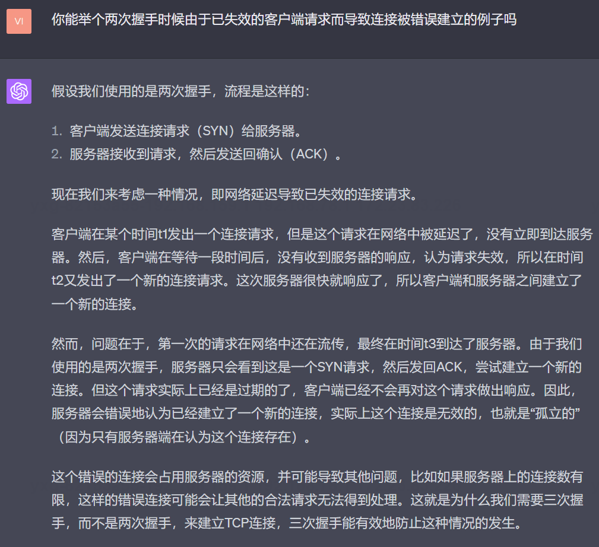
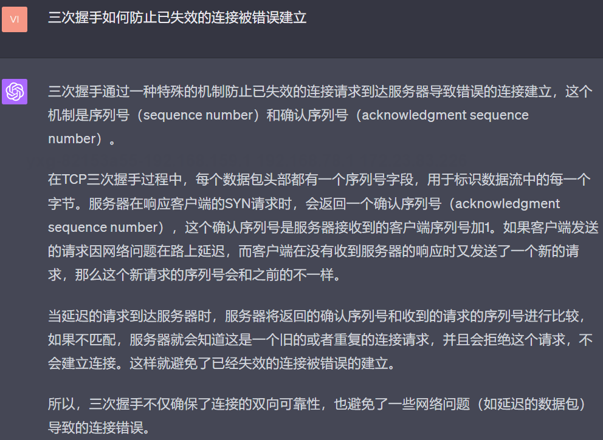
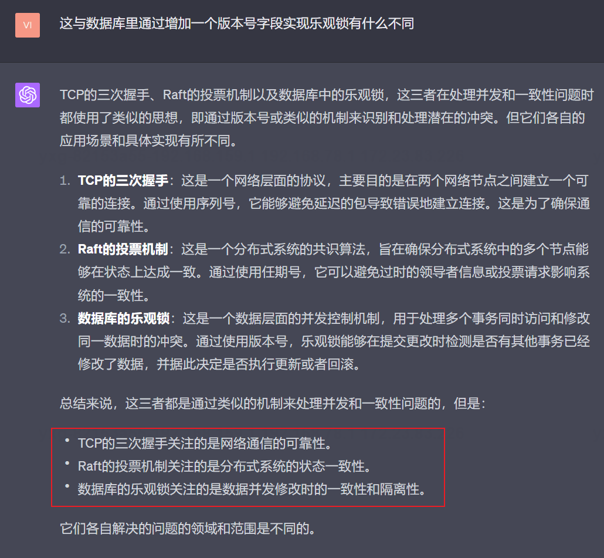
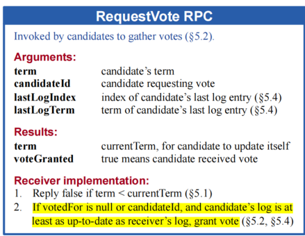

# Lab2A of MIT6.5840-Distributed-System
MIT6.5840(also early called 6.824) Distributed System in Spring 2023  

# 1 如果一个节点断联了，会发生什么
## 1.1 断联的含义是什么
> 指的是一个节点和集群中的其他节点断开，网络不可达，但是自身仍然存活，
> 注意这不等同于机器故障.
> 在测试方法中模拟节点断联的方法是cfg.disconnect
## 1.2 如果是主结点断联并且重连
> 主节点断联，其任期不会递增，但是会不断试图往它认为的两个从节点发送不可达的心跳，同时
> 刷新自己的选举定时器
   （因为断联形成网络分区），等主结点重连后，其作为从节点任期会被更新

## 1.3 从节点断联并且重连
重连后有两种解决方法：
一种是leader的自我否定
> 从节点断联后，因为不是leader节点，不会发送心跳，也就不会重置自己的选举定时器
> 所以会不断的产生选举超时并且自增任期，重连后，因为自己的任期是最大的，但是很有可能
> 自己的日志不是最新的，所以重连后收到主结点的心跳后会将自己的任期反馈给主节点，
> 然后主结点更新自己的任期并且转换为follower角色等待新一轮的选举

一种是通过重连后的从节点开启选举来更新自己的任期：
具体流程和下面这个问题的第二个引用部分基本相同

## 1.4 断联节点重连后是否需要回应leader节点发送的心跳？
本lab中实现的是方案二：
> 可以回应也可以不回应，回应的原因如下：
> 
> 方案一：是可以回应的，因为从节点断联期间的任期会不断增大，比leader还大，那么重连后
> 应该在整个集群内进行重新选举，那么leader节点是怎么知道需要重新选举呢，
> 这就是利用了包含了从节点任期的心跳的响应结构实现的，当从节点重连后会收到
> leader发送过来的心跳，然后会尝试向leader响应自己的任期，leader检查
> 响应体发现比自己的任期大，则会更新自己的任期并且转换为从节点，随后等待集群中
> 的某一个节点选举超时重新发起投票

> 方案二：那为什么可以不回应呢？从节点重连后的问题如何解决？
> 如果不回应，则表明重连后的从节点仅仅是拒绝了leader的心跳，随后从节点
> 在过了超时时间后就会主动发起新一轮的选举操作，因为重连的从节点任期最大，所以
> 其他节点都会修改自己的任期，如果发现从节点的日志和自己一样新，则会投票，
> 否则将自己的状态变为follower，然后等待下一轮的选举超时时间
## 1.5 集群中已经有一个leader，其他的candidate节点还能发起投票吗
本问题答案解释1.4的方案二


#  2 Lab2A - Leader Election
本Lab2A经过了总共1000次的测试操作，0bug，所以大家可以放心参考

本分支的部分代码，尤其是StartElection方法，参考了MIT公开课Lecture5的内容，
[B站MIT空开课6.824](https://www.bilibili.com/video/BV1qk4y197bB?p=5&vd_source=30a5e5e3e51925b04ff7de1bcc435e3f
)
从第47分钟开始看，讲解的比较好，配合我的csdn笔记食用更佳（可以直接定位到第8节）
[lecture 5 notes for MIT6.824](https://editor.csdn.net/md/?articleId=130708325)

如果大家对go语言还不熟，也可以把前47分钟的内容认真看一遍，重点也在我的那篇csdn笔记中

## 2.1 从节点响应主结点RequestVote RPC的时候，每次都应该返回最新的任期吗？

> 如果主节点的任期比自己的大，从节点收到RequestVote RPC后会更新自己的任期，
> 此时我们需要将更新后的任期返回给主节点，主结点拿到的响应后，会比较当前的任期
> 和该节点的任期是否一致，如果不一致则该票是无效的，因为在一个任期内的请求和对应的响应
> rpc的任期是应该相同的情况下，票才有效

> 其实不仅仅是投票阶段，针对日志复制的rpc也是如此

## 2.2 为什么要排除无效票？ 
1 无效票的定义和危害
> 我们把旧任期时产生的投票称为无效票，无效票可能在当前新一轮leader选举时导致产生两个
> leader，举个例子，三个节点ABC，任期为9时节点A率先发起选举，
> 因为网络原因，从节点B和C的响应rpc都没有送到目的实例，
> 在任期等于10的时候，节点B、A先后发起拉票，B节点收到了C节点的投票后成为了leader，
> 与此同时节点A收到了任期9时产生的B和C节点的同意投票rpc，如果A不做比较
> 该投票是旧任期还是新任期，此时A认为自己可以成为leader，
> 此时集群中有两个leader。
>
2 如何识别无效票
> 方法已经在2.1中说了

## 2.3 这种机制与TCP连接建立使用的三次握手而不是两次的联系

### 2.3.1 你能举个两次握手时候由于已失效的客户端请求而导致连接被错误建立的例子吗
根据gpt4的回答，旧的客户端请求可能会导致服务器端建立新的连接，浪费服务器资源



### 2.3.2 三次握手如何防止已失效的连接被错误建立
核心：利用递增的序列号



### 2.3.3 tcp的三次握手机制和这里的raft识别并且丢弃无效票的机制是不是很像

> (1) TCP的三次握手通过使用SYN和ACK消息以及序列号，它能够识别和忽略那些延迟的、
> 不再有效的连接请求。
> 
> (2) Raft的投票机制为了防止由于网络延迟或其他问题导致的过期投票请求被错误地接受，
> Raft使用了任期号(term)。当一个节点收到一个任期号比它当前的任期号更旧的
> 请求时，它会拒绝该请求。
> 
> (3) 两者都利用了额外的一个递增字段来确保识别旧rpc/http的连接或者请求/响应
> 
> (4) 这种机制也用于乐观锁的实现

### 2.3.4 识别无效投票的机制与数据库里通过增加一个版本号字段实现乐观锁有什么不同？




# 3 Lab2A leader election的大概实现流程（面试回答时使用）
## 3.1 创建三个raft实例并且分别初始化
1. 初始化的信息包括自己的实例编号，对等节点数组，实例编号就是其索引，初始为0的任期，为-1的投票对象，设置为Follower的状态，
2. 启动时还应该设置心跳周期和一个选举定时器，心跳周期一般是110ms，保证每秒内不超过10次，选举定时器的随机超时时间设置范围在300ms-600ms,一般随机生成，这样能保证在结点数足够的情况下一次选举周期内大概率能选出一个Leader
3. 为每一个raft实例开启一个ticker协程，这个协程用于超时选举以及发送心跳，这里的ticker协程会持续监控所有存活的实例，每过50毫秒会被唤醒一次，主要用来判断节点的状态，并且做出相应的反馈，
如果当前节点为Follower节点或者Candidate且该节点的选举定时器过期，则重置并且试图发起一次选举操作，如果该节点是Leader节点，则会进行一次判断该leader节点的心跳定时器是否过期，如果是就续期操作，
这个时候会发送一个空的AppendEntries给所属的从节点。
4. 选举流程详解
   - 对于发送端：4.1 针对Follower或者Candidate节点发起的选举操作，先加发送端节点的锁，发出RequestVote RPC之前，它会首先将自己置为Candidate状态、重置自己的选举定时器、任期号自增以及给自己投一票，然后开始拉取选票，
   这个会遍历自己的对等节点数组，并且会开启对等节点数量的协程，向对应的节点发送RequestVote RPC
   并且收集选票，如果票数大于总结点数的一半，那么就可以认为自己是leader并且迅速发送一个空数据的
   AppendEntries给所有的从节点，其他的从节点收到了任期号大于自己的心跳就认为这个Leader合法，
   同时执行一些更新操作，包括将自己转变为Follower状态，更新自己的任期号
   - 对于接收端：4.2 先加接收端节点的锁，如果发送端的任期小于自己的则投拒绝票,同时将自己的投票结果和任期返回给Candidate节点，
   如果相反，则投赞成票，接收端重置自己的选举计时器，更新自己的任期.
5. 对于心跳流程
   - 对于发送端：5.1 心跳只有Leader节点能发送，在一个节点首次由Candidate成为Leader
   后会立即发送一个心跳给对等节点，除此之外，raft实例的监控协程也会定期监控，如果发现自己监控的
   raft实例变成了Leader节点，那么它就会在任期内每一个心跳周期内发送一个心跳给所有对等节点；
   这里也是采用开启多个协程并行发送的rpc的。（如果心跳发送过程中丢失了怎么办？）
   - 对于接收端：5.2 接收到Leader节点的心跳后，会比较两个任期，如果Leader的任期小于自己的则直接丢弃并且
   响应false，如果大于等于则更新自己的任期，重置自己的状态为Follower,同时重置选举定时器，将自己的
   的投票状态设置为-1，表示手里有一票没用，因为已经选出了leader

# 4 Q&A
## 4.1 论文中Figure2的RequestVote RPC及代码段解释：



重点是尚亮部分：
> If votedFor is null or candidateId, and candidate’s log is at
least as up-to-date as receiver’s log, grant vote

代码体现：


Q1: 针对RequestVote rpc的接收方，为什么需要将发送方的candidateId和自己的votedFor进行比较并且结果可以作为是否投票的依据？

答：首先论文中尚亮的部分涉及到日志复制问题，update字段就是表示是否更新自己的日志，因为log replication是Lab2B的工作，所以update这里默认为true，要解决这个问题，
就要看什么时候会出现“rf.votedFor == args.CandidateId”这种情况，一般发送方是leader节点且leader正在发送log AppendEntries RPC时的时候，会出现rf.votedFor == args.CandidateId,
而且这个时候Leader的任期等于Follower的任期，还要看自己投的Leader是不是这个发送方，如果是，则直接更新自己的日志并且刷新自己的选举定时器。

Q2：为什么更新日志的时候从节点也要刷新自己的选举定时器?  

答：因为更新日志的RPC相当于自己的Leader还存活（不然怎么发送RequestAppendEntries），则选举定时器也必须更新一下


## 4.2 为什么心跳周期一般是110ms，保证每秒内不超过10次，选举定时器的随机超时时间设置范围在300ms-600ms, 这样能保证在结点数足够的情况下一次选举周期内一定能选出一个Leader？
  

答：在等待选票期间，候选人可能会收到来自另一台声称自己是领导者的服务器的AppendEntries RPC（追加日志条目远程过程调用）。如果领导者的任期（包含在其RPC中）至少与候选人当前的任期一样大，那么候选人将承认领导者的合法地位，并返回到追随者状态。如果RPC中的任期小于候选人当前的任期，则候选人会拒绝该RPC，并继续保持候选人状态。 
第三种可能的结果是候选人既没有赢得选举也没有失败：如果许多追随者同时成为候选人，选票可能会被分割，以至于没有候选人获得过半数选票。当出现这种情况时，每个候选人将超时并通过增加自己的任期并启动另一轮的RequestVote RPC来开始新的选举。然而，如果没有额外的措施，分割选票可能会无限重复。 
Raft算法使用随机化的选举超时来确保分割选票的情况很少发生，并且能够迅速解决。为了首先防止分割选票，选举超时时间会从一个固定的区间（例如150-300毫秒）中随机选择。这样可以使服务器的选举超时时间分散开来，以至于在大多数情况下，只有一台服务器会超时；它会在其他服务器超时之前赢得选举并发送心跳信号。相同的机制也适用于处理分割选票的情况。每个候选人在选举开始时会重新启动其随机选举超时时间，并在该超时时间结束之前等待，然后开始下一轮选举；这样可以降低新一轮选举中再次出现分割选票的可能性。


## 4.3 raft的代码实现如何利用AppendEntries实现心跳？
答：因为论文中规定AppendEntries为空就表示Leader只是发送心跳，没有包含日志数据，ticker中的定时器体现了这个理论, 因为ticker每间隔50ms就会探测一次节点的状态，如果节点是Leader状态并且探测到该节点的
定时器已经过期，则这个时候必须发送心跳（为什么不采用在发送日志数据时稍带心跳呢？可能是为了减少I/O从而使得心跳更快的达到对方，毕竟心跳定时器过期了，现在要给它快点续期。）


## 4.4 本Lab的一个大坑是选举定时器和心跳定时器的设置


# 5 关于go语言数据竞争的一些demo(很重要，demo会用到case中)

## 场景1

```go
func (rf *Raft) funcA() {
    rf.Term = 1
}

func (rf *Raft) funcB() {
    rf.Term = 2
    rf.funcA()
}

```


如果变量Term同时会被funcB的方法和funcA使用并且修改，funcA又包含在funcB方法中，
此时有两个协程，A访问funcB，B访问funcA，
此时会产生并发问题吗？

> 答：肯定会产生并发问题，因为term没有受到任何锁的保护

## 场景2

1 如果变量Term同时会被funcB的方法和funcA使用并且修改，
funcB的方法体的首尾分别加锁和释放锁，funcA又包含在funcB方法中，
但是没有加锁，此时有两个协程，A访问funcB，B访问funcA，此时会产生并发问题吗？

```go
func (rf *Raft) funcA() {
    rf.Term = 1
}

func (rf *Raft) funcB() {
    rf.mu.Lock()
    rf.Term = 2
    rf.funcA()
    rf.mu.Unlock()
}
```


> 在这种情况下，如果 Term 变量可能会被 funcB 和
> funcA 方法修改，并且这两个方法都在自己的协程中运行，这
> 可能会引发并发问题，特别是数据竞争。这是因为在 funcB 方法中，你
> 在方法的开始和结束时使用了锁，这样在该方法的执行期间，任何其他尝试获取该锁的
> 操作（比如在其他协程中执行的 funcA 方法）都会被阻塞
> ，直到 funcB 方法执行完毕并释放锁。因此，在 funcB 执行期
> 间， Term 是被保护的。然而， funcA 方法并没有使用锁
> 来保护对 Term 的访问和修改**。这意味着如果另一个协程在 funcA
> 方法执行时运行，它可能会在未经同步的情况下访问和修改 Term。** 理解这一句
> 至关重要，因为竞争锁的资格必须是被rf.mu.Lock()和rf.mu.Unlock()包围起来的双方
> ，如果有一个
> 访问该资源的操作没有被包围起来(比如funcA里面对term的写)，
> 那运行这个操作的协程就无需参与锁竞争就可以运行，
> 这就可能导致数据竞争问题。
> 要解决这个问题，你需要确保所有可能访问和修改 Term 的代码都被同一个锁所保护。这
> 意味着你应该在 funcA 方法中添加适当的锁和解锁操作，来保护对 Term 的访问和修改。

2 解决方法1：

```go
func (rf *Raft) funcA() {
    rf.mu.Lock()
	defer rf.mu.Unlock()
    rf.Term = 1
}

func (rf *Raft) funcB() {
	rf.mu.Lock()
    rf.Term = 2
    rf.mu.Unlock()
    rf.funcA()
}
```

## 场景三

1 此时运行funcB会有竞争问题吗？(其实本质和场景二相同)
```go
func (rf *Raft) funcA() {
    rf.Term = 1
}

func (rf *Raft) funcB() {
    rf.mu.Lock()
    go rf.funcA()
    rf.Term = 2
    rf.mu.Unlock()
}
```

> 答：在你的这个例子中，有可能发生数据竞争。你在 funcB 中创建了一个
> 新的协程运行 funcA，但 funcA 中对 Term 的修改没有任何同步机制，
> 所以 funcA 和 funcB 可能会同时尝试访问或修改 Term。
> 具体来说，当你调用 go rf.funcA() 后，新的协程可能会立即开始运行，
> 也可能稍后开始运行，这取决于 Go 的运行时调度。因此， funcA 
> 可能在 rf.mu.Unlock() 调用之前或之后开始运行。
> 如果它在 rf.mu.Unlock() 之前开始运行，并且在 rf.Term = 2 执行之前完成，
> 那么 Term 最后的值将是 2。但是如果 funcA 在 rf.mu.Unlock()
> 之后开始运行，那么 Term 最后的值将是 1，这可能与你的期望不符。

2 解决方案
>要避免这个问题，你需要确保所有可能访问和修改 Term 的代码都被同一个锁所保护
> 。这意味着你应该在 funcA 中添加适当的锁和解锁操作，来保护对 Term 的访问和修改，
> 像这样：
```go
func (rf *Raft) funcA() {
    rf.mu.Lock()
    rf.Term = 1
    rf.mu.Unlock()
}

func (rf *Raft) funcB() {
    rf.mu.Lock()
    go rf.funcA()
    rf.Term = 2
    rf.mu.Unlock()
}
```
> 这样就可以避免并发问题了。每次只有一个协程（要么是执行 funcA 的协程，
> 要么是执行 funcB 的协程）可以访问和修改 Term。然而，这并不能保证 Term 的最终值，
> 因为 funcA 和 funcB 的执行顺序依然是不确定的。如果你需要确定 Term 的最终值
> ，你需要使用其他的同步机制，如条件变量或通道。


## 场景四 方法调用时导致的死锁

1 下面调用funcB时候会导致死锁，因为funcA在执行方法funcB的线程里，相当于单线程调用，
因为rf.mu.Lock()是不可重入的，所以当路径走到rf.funcA()的时候就死锁了
```go
func (rf *Raft) funcA() {
    rf.mu.Lock()
    rf.Term = 1
    rf.mu.Unlock()
}

func (rf *Raft) funcB() {
    rf.mu.Lock()
    rf.funcA()
    rf.Term = 2
    rf.mu.Unlock()
}
```
2 去掉funcA的锁，调用funcB就能正常执行了
```go
func (rf *Raft) funcA() {
    rf.Term = 1
}

func (rf *Raft) funcB() {
    rf.mu.Lock()
    rf.funcA()
    rf.Term = 2
    rf.mu.Unlock()
}
```
3  解决方案: 调用方法funcA时选择再开一个协程，这样在funcA里就能使用锁
```go
func (rf *Raft) funcA() {
    rf.mu.Lock()
    rf.Term = 1
    rf.mu.Unlock()
}

func (rf *Raft) funcB() {
    rf.mu.Lock()
    go rf.funcA()
    rf.Term = 2
    rf.mu.Unlock()
}
```
